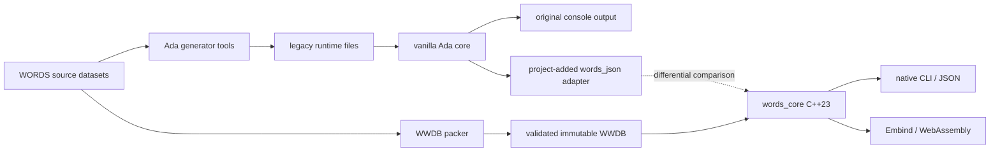

# WordsWASM

WordsWASM is a C++23 Latin morphological analysis engine derived from the
data and behaviour of William Whitaker's WORDS. It targets both native
applications and WebAssembly while preserving the Ada implementation as an
oracle for compatibility testing.

The project currently provides:

- UTF-8 input with macron and breve support;
- typed morphological analysis and resolved search results;
- compact, validated WWDB datasets;
- separate full and search-only database profiles;
- a native command-line interface and an Embind browser API;
- differential tests against the bundled Ada engine.

## Relationship to vanilla Whitaker's WORDS

WordsWASM is a behavioural port and data descendant of Whitaker's WORDS, not
the original Ada program compiled to WebAssembly. In this document, *vanilla
WORDS* means the console-oriented Ada code maintained in
[mk270/whitakers-words](https://github.com/mk270/whitakers-words).

There are consequently two implementations in this repository:

- the current product at the repository root: an instance-based C++23 library
  with native and WebAssembly frontends;
- [`whitakers-words/`](whitakers-words/): an Ada reference tree used as the
  source-data toolchain and compatibility oracle.

The bundled Ada tree is not a byte-for-byte pristine copy of vanilla WORDS.
This project adds `words_json` and its canonical JSON serializer to the Ada
tree solely as a deterministic adapter for differential testing; neither the
command nor the JSON contract belongs to vanilla WORDS. The morphological core
and its data lineage remain those of WORDS; the two Git origins are recorded in
[`whitakers-words/remotes.txt`](whitakers-words/remotes.txt).

### Architectural differences

| Concern | Vanilla Whitaker's WORDS | Current WordsWASM |
| --- | --- | --- |
| Program shape | A collection of Ada packages centred on an interactive console executable, plus separate dictionary-building tools. | A reusable `words_core` C++23 library, a separate native JSON presentation library and CLI, and an Emscripten/Embind frontend. |
| Runtime state | Package-level mutable arrays, fixed-capacity intermediate buffers, runtime parameters, and direct-access files opened during initialization. The design is not naturally reentrant. | An `Engine` owns a validated, immutable `Database` snapshot. Queries return owning typed results; database views are lifetime-bound to the engine, and independent engine instances do not share mutable analysis state. |
| Data layout | Human-edited sources are compiled by `makedict`, `makestem`, and `makeinfl` into `DICTFILE`, `STEMFILE`, `INDXFILE`, and `INFLECTS.SEC`; `ADDONS.LAT` and `UNIQUES.LAT` are also loaded at runtime. Some binary layouts depend on the historical Ada representation. | The packer converts the inherited lexical, inflection, addon, unique, rewrite, and quantity data into a versioned WWDB image. The loader validates its header, sections, IDs, enums, bounds, ordering, and checksum before publishing the snapshot. Full and search-only profiles keep the same dataset-local IDs. |
| Input model | The historical interface and data formats are ASCII/DOS-oriented and apply the traditional `i/j` and `u/v` lookup conventions. | A strict UTF-8 lexer validates and normalizes NFC/NFD input, preserves a presentation spelling, derives a separate ASCII lookup key, and carries macron/breve quantity per logical letter. |
| Analysis pipeline | Enumerate endings, derive candidate stems, search indexed stems, cross-check morphology, try bounded addons and spelling tricks, then filter and print. Intermediate meaning is distributed across `Parse_Record`, global arrays, addon markers, and presentation packages. | The same observable pipeline and its intentional derivational limits are preserved, but candidates, morphology, lexical identities, rewrites, derivation steps, quantities, and provenance are represented in a typed IR with strong IDs. |
| Public result | Primarily formatted terminal/file output controlled by mutable user and developer parameters. | A typed `QueryResult` is the core contract. Native JSON and browser structs are separate, schema-tested projections; the WebAssembly boundary exposes neither JSON parsing nor raw allocator pointers. |
| Deployment | Native Ada executables built with GNAT/GPRbuild and accompanied by several runtime data files. | Native CMake targets or a modular ES/WebAssembly artifact for browser, Worker, and Node, initialized from one WWDB byte image. |
| Verification | Historical text fixtures exercise the Ada executable. | C++ unit tests, schema and browser-contract tests, data-pipeline tests, and corpus-level differential tests run the Ada implementation as an oracle. Deliberate differences are classified instead of silently changing compatibility. |

The algorithmic relationship can be summarized as follows:



### What the Git history shows

The repository began with a CMake/C++ skeleton in `dbb7b2f`. Commit `aa0eb48`
introduced the first complete native parser checkpoint: the typed model,
database loader, engine, JSON schemas, CLI, WebAssembly entry point, and
differential tests. Commit `7d4b50b` then imported the Ada tree and data
toolchain as a single snapshot while connecting the build, WWDB pipeline,
browser wrapper, and oracle tests. Later commits separated search and
presentation concerns (`298aec0`), moved shared semantics out of JSON and
versioned the browser protocol (`14f344f`), centralized the WWDB wire schema
(`caa32cc`), and expanded the typed morphological IR (`d8d76e7`).

This history explains the project boundary: the C++ engine evolved as a new
architecture beside the Ada oracle; it is not a sequence of mechanical Ada
source translations. Because the Ada directory was imported wholesale in
`7d4b50b`, this repository's log records the integration point, not the full
upstream Ada ancestry. Consult the two repositories listed in
[`remotes.txt`](whitakers-words/remotes.txt) for that earlier history.

A direct remote audit on 2026-09-01 makes the lineage more precise. The
project fork was at
[`222fcb2`](https://github.com/Fabio3rs/whitakers-words/commit/222fcb2150da2358f3c79672135a697f4c92fff6),
the upstream was at
[`1f2f0fb`](https://github.com/mk270/whitakers-words/commit/1f2f0fb0867a896d7b9284a03d615ed635d6f992),
and their common ancestor was
[`9b11477`](https://github.com/mk270/whitakers-words/commit/9b11477e53f4adfb17d6f6aa563669dc71e0a680).
At those revisions, upstream had 46 commits not in the fork and the fork had
one commit not in upstream. The vendored directory is therefore a locally
extended snapshot based on the fork's line, not a mirror of the current
upstream branch.

Neither remote contains `words_json`,
`List_Package.Canonical_JSON`, or `test/run-json-tests.py`. In the WordsWASM
history they first appear inside the snapshot imported by `7d4b50b`, together
with the deterministic `Initialize_Canonical_Engine` path. Comparing that
snapshot with the fork shows that these are local integration additions; the
main Ada morphology packages otherwise remain substantially inherited. The
same local layer also contains the WWDB packer, typed rewrite and quantity
data, browser-oriented design documents, and the later packon requirements.

## Building

The build order matters for tests and for a usable CLI. Generated Ada runtime
files, Ada executables, and WWDB images are intentionally not tracked by Git.

### Native binaries only

If a compatible WWDB will be obtained separately, the C++ library and CLI can
be compiled without GNAT or the Ada oracle:

```sh
git submodule update --init --recursive
cmake -S . -B build/native -G Ninja \
  -DCMAKE_BUILD_TYPE=Release \
  -DENABLE_TESTS=OFF
cmake --build build/native --target words_cli -j"$(nproc)"
```

This only builds the code. `words_cli` still needs a WWDB passed with
`--database`; no deployable `.wwdb` is committed to the repository.

### Complete native build and test suite

For a clean checkout, use this order:

```sh
git submodule update --init --recursive

# 1. Build the Ada oracle and generate its legacy runtime data.
make -C whitakers-words -j"$(nproc)" \
  GPRBUILD_OPTIONS="-j$(nproc)" all

# 2. Configure and build the C++ engine, tests, and packer.
cmake -S . -B build/native -G Ninja \
  -DCMAKE_BUILD_TYPE=Release
cmake --build build/native \
  --target words_cli words_tests wwdb_poc_pack \
  -j"$(nproc)"

# 3. Generate both database profiles expected by the tests.
mkdir -p whitakers-words/poc/compact-db/output
build/native/wwdb_poc_pack \
  whitakers-words \
  whitakers-words/poc/compact-db/output/words-poc-dense.wwdb \
  dense
build/native/wwdb_poc_pack \
  whitakers-words \
  whitakers-words/poc/compact-db/output/words-poc-search-only.wwdb \
  search-only

# 4. Run the complete native, differential, and data-pipeline suite.
ctest --test-dir build/native --output-on-failure
```

The database files are runtime fixtures, not CMake outputs. Building the
`wwdb_poc_pack` target creates the packer executable but does not run it, so
step 3 must not be omitted before the complete `ctest` invocation.

The main test prerequisites are:

- `words-poc-dense.wwdb`: C++ database/engine tests and the focused
  differential suite;
- both dense and search-only WWDBs: the corpus differential suite;
- `whitakers-words/bin/words_json`: the focused and corpus differential
  suites; it is produced by the Ada build;
- the packer plus the generated Ada data: the lexeme-import integration test,
  which creates additional temporary WWDBs itself.

Lexer, artificial-result, and browser-wrapper unit tests do not load these
fixtures, but the complete suite does. GTest is required for `words_tests`;
Python 3 and `jsonschema` are required for the differential and data-pipeline
tests. Node.js enables the browser-wrapper test.

GNAT/GPRbuild are required for the Ada build. Emscripten is required for the
browser build; exporting and smoke-testing browser assets also requires the
generated WWDBs. See
[the browser documentation](whitakers-words/docs/webassembly-browser.md) for
the WebAssembly commands and deployment layout.

## Databases

The two deployable WWDB profiles share the same lexeme and rule IDs:

- `words-full.wwdb` includes morphology, metadata, and meanings;
- `words-search.wwdb` is intended for applications that already provide
  definitions from external dictionaries. It omits Whitaker's meanings but
  still resolves lemmas, parts of speech, morphology, flags, and stable IDs
  within the dataset that can be used by the application's search layer.

The format and data pipeline are described in
[the implementation overview](whitakers-words/docs/estado-implementacao.md).

## Documentation

The detailed design notes are in
[`whitakers-words/docs/`](whitakers-words/docs/). They cover the Ada oracle,
the C++23 architecture, Unicode and vowel quantity, compact storage, browser
integration, and lexical enrichment.

## Development disclosure

The architectural analyses, proofs of concept, documentation, and portions of
the proposed engine implementation in this project were developed with the
assistance of an LLM, OpenAI Codex. The original WORDS program and its lexical
data are the work of William Whitaker and their subsequent contributors.

## License

The original WordsWASM code is available under the
[MIT License](LICENSE), copyright 2026 Fabio R. Sluzala.

William Whitaker's WORDS source code and data under `whitakers-words/` retain
their original permissive license and attribution request. See
[`whitakers-words/LICENCE.txt`](whitakers-words/LICENCE.txt) for the complete
terms.

Third-party components in [`vendor/`](vendor/) retain their respective
licenses.
