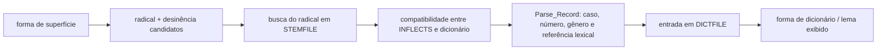

# Algoritmo de identificação de lema, caso e declinação

Este documento descreve a implementação deste repositório do Whitaker's
WORDS. O foco é a análise de uma forma latina flexionada e, em particular, a
origem de três informações exibidas pelo programa: forma de dicionário (aqui
chamada de **lema**), caso e declinação.

## Resumo

O WORDS é um analisador morfológico baseado em léxico e regras, não um
lematizador estatístico. Para uma palavra, ele:

1. enumera as desinências que coincidem com o fim da palavra;
2. retira cada desinência e obtém candidatos a radical;
3. procura esses radicais no índice do dicionário;
4. cruza os atributos da desinência com os atributos da entrada lexical;
5. conserva todas as combinações compatíveis;
6. recupera a entrada completa do dicionário e reconstrói sua forma de
   citação.



O programa não escolhe necessariamente uma análise única. Se uma forma for
ambígua, todas as análises sobreviventes podem ser mostradas. Ele também não
usa as palavras vizinhas para decidir entre, por exemplo, genitivo singular e
nominativo plural.

## Conceitos e estruturas de dados

### Radical, chave e lema

Uma entrada do dicionário contém até quatro radicais (`Stems (1 .. 4)`). A
posição do radical é sua `Stem_Key_Type`, chamada de **chave** neste documento.
A chave indica a série de formas à qual o radical pertence. Substantivos têm
até dois radicais; adjetivos, numerais e verbos podem ter até quatro. Essa
quantidade é definida por `Number_Of_Stems` em
[`latin_utils-dictionary_package.adb`](../src/latin_utils/latin_utils-dictionary_package.adb).

Não há um campo `lemma` em `Dictionary_Entry`. A forma de dicionário é
reconstruída posteriormente a partir dos radicais, da classe gramatical, da
declinação/conjugação e da variante. Por exemplo, para um substantivo da
primeira declinação, variante 1, o programa acrescenta `a` ao radical 1 e
`ae` ao radical 2. Essa lógica está em
[`support_utils-dictionary_form.adb`](../src/support_utils/support_utils-dictionary_form.adb).

Portanto, neste código:

- a referência à entrada lexical é o par `D_K` + `MNPC`;
- a forma de dicionário exibida é a melhor aproximação do **lema**;
- para substantivos, ela normalmente contém nominativo e genitivo, como
  `rosa, rosae`, e não apenas uma string canônica `rosa`.

### Declinação e variante

A declinação é representada por `Decn_Record`:

```ada
type Decn_Record is record
   Which : Which_Type;   -- declinação/conjugação principal
   Var   : Variant_Type; -- subparadigma ou variante
end record;
```

Assim, `1 1` significa primeira declinação, variante 1; `3 1`, terceira
declinação, variante 1. Valores zero nas regras funcionam como curingas: por
exemplo, uma regra `1 0` aceita variantes lexicais da primeira declinação. As
regras de inclusão estão no operador `<=` de
[`latin_utils-inflections_package.adb`](../src/latin_utils/latin_utils-inflections_package.adb).

`9 8` e `9 9` são convenções internas para abreviações e formas indeclináveis,
respectivamente; não são sexta a nona declinações latinas.

### Regra de flexão

Cada registro carregado de `INFLECTS.LAT` guarda:

- classe gramatical;
- declinação/conjugação e variante;
- caso, número e gênero, quando aplicáveis;
- chave do radical;
- tamanho e texto da desinência;
- época e frequência.

Por exemplo:

```text
N     1 1 GEN S C  2 2 ae        X A
```

significa: substantivo, primeira declinação, variante 1, genitivo singular,
gênero comum/masculino-ou-feminino, usando o radical de chave 2 e a desinência
`ae`, de tamanho 2. `INFLECTS.LAT` é compilado em `INFLECTS.SEC` pelo programa
`makeinfl`.

### Índices do dicionário

`DICTLINE.GEN` é a fonte textual das entradas. Durante a geração dos dados:

- `DICTFILE.GEN` recebe as entradas completas;
- `STEMFILE.GEN` recebe um registro para cada radical, contendo o radical, os
  atributos lexicais, sua chave e o número (`MNPC`) da entrada completa;
- `INDXFILE.GEN` delimita, por duas letras iniciais, as faixas de
  `STEMFILE.GEN` que devem ser pesquisadas.

Essa separação permite procurar radicais sem ler a entrada e o significado
completos em cada comparação.

O layout físico desses artefatos, incluindo os registros binários de
`DICTFILE.GEN`, `STEMFILE.GEN` e `INFLECTS.SEC`, está documentado em
[`formato-binario-dados.md`](formato-binario-dados.md). `INDXFILE.GEN`, apesar
do nome, é texto ASCII de largura fixa.

## Fluxo detalhado

### 1. Pré-processamento e casos especiais

`Parse_Latin_Word`, em
[`words_engine-parse.adb`](../src/words_engine/words_engine-parse.adb), coordena
a análise completa. O fluxo normal chega a `Word`, em
[`words_engine-word_package.adb`](../src/words_engine/words_engine-word_package.adb).

`Word` converte a palavra para minúsculas. As comparações tratam `u`/`v` e
`i`/`j` como equivalentes. Antes da análise geral, são consultados:

- `UNIQUES.LAT`, para formas irregulares ou analisadas diretamente;
- rotinas especiais para pronomes em `qu-`/`cu-` e seus *packons*.

No fluxo externo a `Word`, também existem tratamentos para números romanos,
síncope, enclíticos e transformações ortográficas (*tricks*). Eles ampliam o
conjunto de candidatos, mas não alteram o princípio de cruzar regra de flexão
e entrada lexical.

### 2. Enumeração de desinências (`Run_Inflections`)

`Run_Inflections` carrega somente a seção de `INFLECTS.SEC` compatível com a
última letra da palavra. As regras são indexadas por:

- tamanho da desinência, de 1 a `Max_Ending_Size` (7);
- última letra da desinência.

O algoritmo testa os comprimentos em ordem decrescente. Para cada regra cuja
desinência coincide com o sufixo da palavra, cria:

```text
radical candidato = palavra sem a desinência
hipótese           = radical + registro completo da flexão
```

Desinências vazias também são consideradas para classes que as admitem. Um
radical pode ter no máximo 18 caracteres.

Nesse estágio o caso já está presente na hipótese, pois veio da regra de
`INFLECTS.LAT`, mas ainda não foi confirmado por uma entrada lexical.

### 3. Busca dos radicais (`Search_Dictionaries`)

Os radicais candidatos distintos são pesquisados em todos os dicionários
disponíveis (`General`, `Special` e `Local`). Para os dicionários ordenados:

1. as duas primeiras letras selecionam uma faixa por meio de `INDXFILE`;
2. uma busca binária encontra o radical em `STEMFILE`;
3. todos os registros adjacentes com o mesmo radical são copiados para a lista
   reduzida `PDL`.

O dicionário local, que não é ordenado da mesma forma, é percorrido
linearmente dentro da faixa de sua primeira letra. Radicais vazios ou de uma
letra usam a tabela especial `BDL`.

A busca é lexical: encontrar o mesmo texto de radical não basta para aceitar a
análise.

### 4. Cruzamento morfológico (`Reduce_Stem_List`)

Para cada radical encontrado no dicionário e para cada hipótese de flexão, o
programa verifica:

1. mesmo comprimento de radical após eventuais prefixos/sufixos;
2. chave de radical compatível;
3. classe gramatical compatível — particípio (`VPAR`) e supino são associados
   a entradas verbais;
4. declinação/conjugação e variante compatíveis;
5. restrições específicas da classe, como gênero para substantivos, grau para
   adjetivos e regência para preposições.

Para substantivos, a condição principal é equivalente a:

```text
chave lexical aceita chave da regra
e classe lexical = classe da regra
e declinação lexical está contida na declinação da regra
e gênero lexical está contido no gênero da regra
```

Quando a combinação é aceita, o `Parse_Record` final é montado com dados das
duas origens:

| Campo da análise | Origem |
| --- | --- |
| declinação e variante | entrada do dicionário |
| caso e número | regra de `INFLECTS.LAT` |
| gênero do substantivo | entrada do dicionário |
| desinência, época e frequência da flexão | regra de `INFLECTS.LAT` |
| radical, dicionário e `MNPC` | encontro em `STEMFILE` |

Esta divisão é importante: a desinência propõe o caso e um paradigma
compatível, enquanto a entrada lexical confirma o paradigma e fornece a
declinação definitiva. O caso não é lido da entrada do dicionário, e a
declinação não é decidida apenas pela terminação gráfica.

### 5. Afixos e enclíticos

Se a análise direta falhar, ou se a configuração mandar aplicar correções de
qualquer modo, o programa pode retirar prefixos e sufixos descritos em
`ADDONS.LAT`, pesquisar novamente o radical resultante e repetir o cruzamento.
Enclíticos (*tackons*), como `-que`, seguem caminho semelhante e preservam no
resultado um registro que explica a parte removida.

Os afixos podem restringir a classe de origem, a chave do radical e a classe
de destino. Por isso sua aplicação não é uma simples remoção textual.

#### Exemplo derivacional: `anaticulus`

O caminho entre pacotes Ada, as estruturas intermediárias e o limite de uma
camada de sufixo são detalhados em
[`arquitetura-ada-fluxo-dados.md`](arquitetura-ada-fluxo-dados.md).

`anaticulus` ilustra uma análise em três camadas:

```text
anat + icul + us
│      │      └─ desinência flexional
│      └──────── sufixo derivacional diminutivo
└─────────────── radical lexical
```

Primeiro, `Run_Inflections` reconhece `-us` como possível nominativo singular
da segunda declinação e produz o radical flexionado candidato `anaticul`. A
regra de `INFLECTS.LAT` tem gênero `X`; o masculino exibido abaixo é definido
depois pelo alvo da regra derivacional `icul`:

```text
anaticul.us  N 2 1 NOM S M
```

Existe uma entrada literal `anaticul` em `STEMFILE.GEN`, correspondente a
`anaticula`, substantivo feminino da primeira declinação. Ela não confirma
essa hipótese, pois `N 1 1 F` é incompatível com a regra `N 2 1 NOM S M`.
Encontrar o mesmo texto de radical, portanto, continua não sendo suficiente.

Na tentativa derivacional, `Apply_Suffix` encontra estas três regras em
`ADDONS.LAT`:

```text
SUFFIX icul
N 2 N 1 1 F x 0

SUFFIX icul
N 2 N 2 1 M x 0

SUFFIX icul
N 2 N 2 2 N x 0
```

O primeiro `N 2` de cada regra restringe a origem a um substantivo e a seu
radical de chave 2. O registro seguinte descreve o resultado: substantivo da
primeira declinação feminino, da segunda masculino ou da segunda neutro. O
último zero é a chave do radical derivado.

Para a leitura masculina exibida pelo programa, a segunda regra faz:

```text
anaticul - icul = anat

origem:    anat       N 3 1 F, chave 2
sufixo:    icul       N/chave 2 → N 2 1 M/chave 0
derivado:  anaticul   N 2 1 M
flexão:    us         NOM S M
resultado: anaticulus N 2 1 NOM S M
```

`anat` é o segundo radical das entradas `anas, anatis`. O sufixo transforma
temporariamente os atributos lexicais da entrada encontrada: classe, paradigma,
gênero e chave passam a ser os atributos de destino declarados em `ADDONS.LAT`.
`Reduce_Stem_List` então verifica se `anat + icul` recompõe `anaticul` e se o
resultado transformado é compatível com a flexão em `-us`.

A saída preserva as camadas:

```text
icul                 SUFFIX
little, small, -let (Diminutive)

anaticul.us          N 2 1 NOM S M
anas, anatis         N 3rd F
duck
```

Há duas entradas `anas/anat` morfologicamente idênticas no dicionário: uma
significa “duck” e outra “senility in women; disease in old women”. Como o
cruzamento não avalia se o significado da raiz combina semanticamente com o
diminutivo, ambas podem sobreviver. Este é um exemplo de ambiguidade lexical
formal que exigiria conhecimento semântico para ser eliminada.

O mecanismo atual admite uma composição limitada, conceitualmente:

```text
[prefixo] + radical + [sufixo derivacional] + desinência + [enclítico]
```

Ele não é um segmentador derivacional recursivo geral. `Apply_Suffix` testa um
sufixo cadastrado por vez, pesquisa imediatamente o radical restante e não
chama novamente `Apply_Suffix`. `Apply_Prefix` também aceita um prefixo por vez;
outras camadas dependem das rotinas separadas para *packons*, *tackons* e
correções ortográficas.

Por isso `anaticuliculus` é reconhecido: depois de remover `-us` e uma ocorrência
de `icul`, sobra `anaticul`, já lexicalizado como radical de `anaticula`.
`anaticuliculiculus`, porém, exigiria remover `icul` duas vezes antes de chegar
a essa entrada e termina como `UNKNOWN`. O segundo caso é lexicalização
intermediária, não recursão do algoritmo.

### 6. Ordenação, filtragem e ambiguidades

Os resultados são ordenados principalmente por referência lexical (`MNPC`),
tamanho da desinência, atributos morfológicos e dicionário. Duplicatas com a
mesma qualidade morfológica e a mesma entrada lexical são eliminadas.

Depois, `List_Sweep`, em
[`words_engine-list_sweep.adb`](../src/words_engine/words_engine-list_sweep.adb),
aplica restrições adicionais — por exemplo, pessoas permitidas no imperativo,
verbos impessoais e deponentes — e pode ocultar alternativas arcaicas,
medievais ou incomuns conforme a configuração.

Essa ordenação não constitui desambiguação contextual. Ordem e filtros podem
dar preferência de exibição a certas análises, mas o algoritmo conserva casos
gramaticalmente distintos quando todos são possíveis.

### 7. Recuperação e construção do lema

Cada `Parse_Record` aceito carrega `D_K` e `MNPC`. Na preparação da saída,
`Cycle_Over_Pa`, em
[`words_engine-list_package.adb`](../src/words_engine/words_engine-list_package.adb),
usa esse par para ler a `Dictionary_Entry` completa em `DICTFILE`.

`Support_Utils.Dictionary_Form` então constrói a forma de citação. Para
substantivos regulares:

- primeira declinação, variante 1: radical 1 + `a`, radical 2 + `ae`;
- segunda declinação: a terminação depende da variante e do gênero;
- terceira declinação: radical 1 sem acréscimo, radical 2 + `is` (com exceções
  codificadas);
- quarta e quinta declinações: terminações próprias codificadas por variante.

Há regras análogas para pronomes, adjetivos, verbos e numerais. Portanto, o
lema exibido é derivado da entrada já identificada; ele não é obtido revertendo
apenas a desinência observada.

## Exemplo: `rosae`

A fonte lexical contém, de forma simplificada:

```text
radical 1 = ros
radical 2 = ros
classe    = N
declinação/variante = 1 1
gênero    = F
```

Para a entrada `rosae`, `Run_Inflections` encontra várias regras terminadas em
`ae`. Entre elas estão:

```text
N 1 1 GEN S C  chave 2  final ae
N 1 1 LOC S C  chave 2  final ae
N 1 0 DAT S C  chave 2  final ae
N 1 0 NOM P C  chave 2  final ae
N 1 0 VOC P C  chave 2  final ae
```

Todas produzem o radical candidato `ros`. A busca encontra o radical lexical
de chave 2. A declinação lexical `1 1` é compatível tanto com regras `1 1`
quanto com o curinga `1 0`, e o gênero feminino é aceito pela regra de gênero
`C`. Assim, as cinco análises nominais sobrevivem.

Em cada resultado:

- `N 1 1` usa a declinação e a variante da entrada lexical;
- `GEN S`, `LOC S`, `DAT S`, `NOM P` ou `VOC P` vêm da regra de flexão;
- `F` vem da entrada lexical;
- `rosa, rosae` é reconstruído dos dois radicais e do paradigma `1 1`.

O mesmo texto também pode coincidir com entradas e regras de outras classes,
como um particípio verbal. O programa mostra essas análises separadamente; não
usa a frase para escolher apenas o substantivo.

## Pseudocódigo do caminho principal

```text
analisar(palavra):
    palavra := minúsculas(palavra)
    resultados := procurar_em_UNIQUES(palavra)
    resultados += analisar_pronomes_especiais(palavra)

    hipóteses := []
    para cada regra indexada pelo final da palavra:
        se palavra termina_com regra.desinência:
            radical := retirar_final(palavra, regra.desinência)
            hipóteses += (radical, regra)

    candidatos_lexicais := procurar_radicais_no_STEMFILE(hipóteses.radicais)

    para cada candidato em candidatos_lexicais:
        para cada hipótese do mesmo radical:
            se chave, classe, declinação e restrições são compatíveis:
                resultados += combinar(candidato, hipótese)

    se necessário:
        repetir a busca depois de aplicar afixos/enclíticos permitidos

    resultados := ordenar_remover_duplicatas_e_filtrar(resultados)

    para cada resultado:
        entrada := ler_DICTFILE(resultado.D_K, resultado.MNPC)
        resultado.forma_de_dicionário := construir_forma(entrada)

    retornar todos os resultados
```

## Limites relevantes

- A análise depende da cobertura e da correção de `DICTLINE.GEN`,
  `INFLECTS.LAT`, `UNIQUES.LAT` e `ADDONS.LAT`.
- Formas homógrafas permanecem ambíguas sem análise sintática ou semântica da
  frase.
- O tratamento de `u`/`v` e `i`/`j` é por equivalência ortográfica; o motor Ada
  não representa quantidade vocálica. A engine futura foi planejada para
  aceitar quantidade opcional sem mudar o comportamento ASCII, conforme
  [`plano-unicode-quantidade-vocalica.md`](plano-unicode-quantidade-vocalica.md).
- Parte do comportamento depende dos modos `Do_Fixes`, `Do_Tricks`,
  `Trim_Output` e dos filtros de época/frequência.
- Limites fixos, como radical de 18 caracteres, desinência de 7 e tamanhos dos
  arrays de resultados, fazem parte da implementação histórica.

## Mapa do código

| Responsabilidade | Arquivo/procedimento principal |
| --- | --- |
| coordenação da análise latina | `words_engine-parse.adb`: `Parse_Latin_Word`, `Pass` |
| geração de radicais candidatos | `words_engine-word_package.adb`: `Run_Inflections` |
| busca no índice lexical | `words_engine-word_package.adb`: `Search_Dictionaries`, `Dictionary_Search` |
| cruzamento regra × entrada | `words_engine-word_package.adb`: `Reduce_Stem_List` |
| tipos de caso, declinação e flexão | `latin_utils-inflections_package.ads` |
| tipos das entradas e resultados | `latin_utils-dictionary_package.ads` |
| filtragem final | `words_engine-list_sweep.adb`: `List_Sweep` |
| recuperação da entrada completa | `words_engine-list_package.adb`: `Cycle_Over_Pa` |
| construção da forma de dicionário | `support_utils-dictionary_form.adb` |
