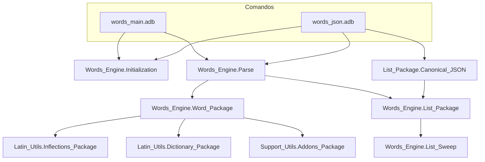
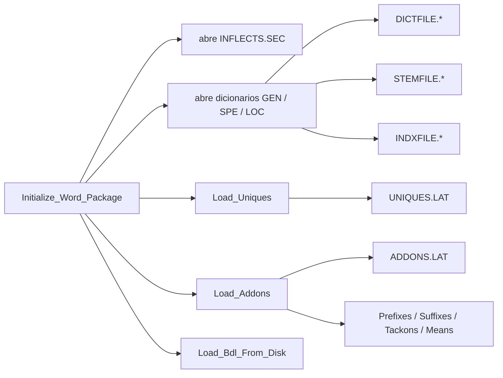
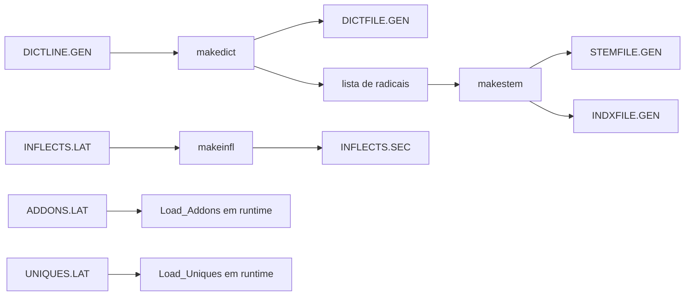
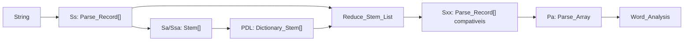
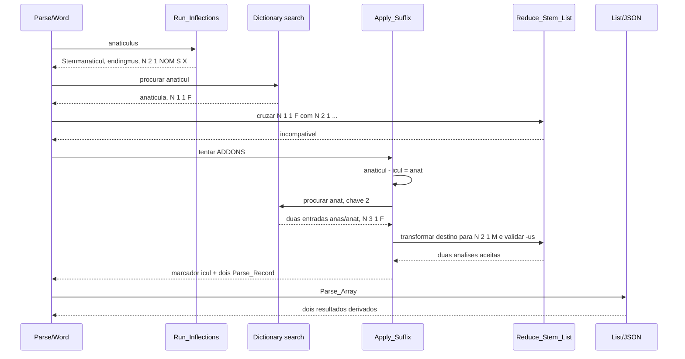
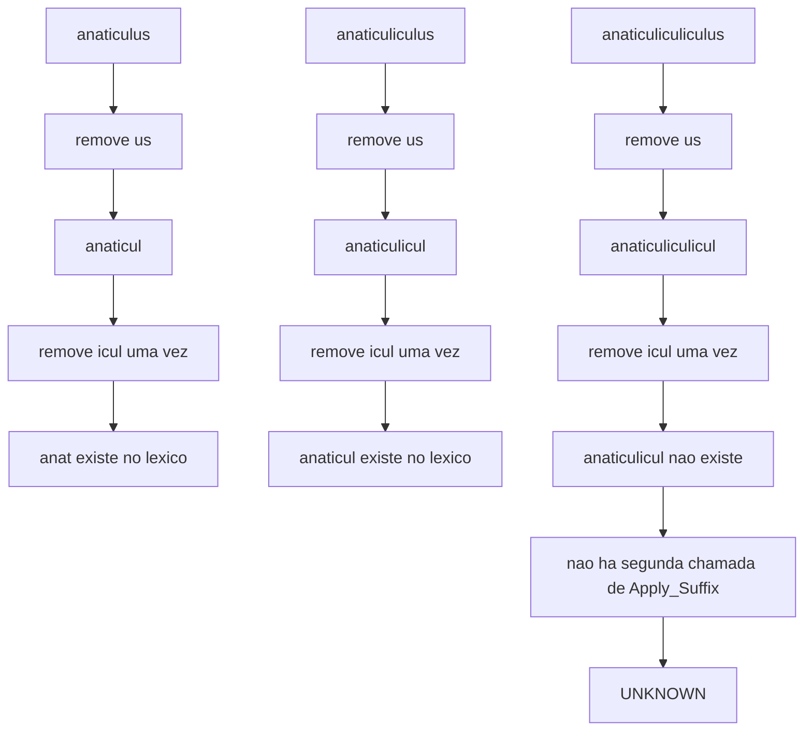

# Arquitetura Ada e fluxo de dados da análise morfológica

Este documento apresenta uma visão de alto nível do código Ada de Whitaker's
WORDS. O foco é o caminho percorrido por uma palavra, as estruturas que ligam
as etapas e o limite derivacional observado em `anaticulus`,
`anaticuliculus` e `anaticuliculiculus`.

Os detalhes linguísticos de cada etapa estão em
[`algoritmo-analise-morfologica.md`](algoritmo-analise-morfologica.md). Os
formatos físicos dos arquivos compilados estão em
[`formato-binario-dados.md`](formato-binario-dados.md).

## Visão geral

O analisador não começa procurando a palavra inteira no dicionário. Ele:

1. enumera desinências flexionais compatíveis com o final da palavra;
2. produz hipóteses de radical e flexão;
3. procura os radicais no índice lexical;
4. cruza cada encontro lexical com a hipótese flexional;
5. se necessário, tenta uma camada de prefixo ou sufixo de `ADDONS.LAT`;
6. filtra, agrupa e apresenta as análises sobreviventes.

```mermaid
flowchart LR
    A[texto de entrada] --> B[Parse_Line / Analyse_Line]
    B --> C[Parse_Latin_Word / Pass]
    C --> D[Word]
    D --> E[Run_Inflections]
    E --> F[hipoteses Parse_Record]
    F --> G[Prune_Stems]
    G --> H[Search_Dictionaries]
    H --> I[Reduce_Stem_List]
    G -. falha ou incompatibilidade .-> J[Apply_Prefix / Apply_Suffix]
    J --> H
    I --> K[Parse_Array]
    K --> L[Analyse_Word / List_Sweep]
    L --> M[Word_Analysis]
    M --> N[saida textual]
    M --> O[JSON canonico]
```



## Pacotes e responsabilidades



| Camada | Arquivo principal | Papel |
| --- | --- | --- |
| entrada interativa/CLI | [`words_main.adb`](../src/commands/words_main.adb) | inicializa o motor e entrega linhas a `Process_Input` |
| entrada JSON | [`words_json.adb`](../src/commands/words_json.adb) | analisa uma palavra com configuração determinística e serializa o resultado; `--batch-json-lines` reutiliza a engine para uma consulta por linha nos testes de corpus |
| coordenação | [`words_engine-parse.adb`](../src/words_engine/words_engine-parse.adb) | separa a linha, executa os passes e coordena alternativas ortográficas |
| núcleo morfológico | [`words_engine-word_package.adb`](../src/words_engine/words_engine-word_package.adb) | gera radicais, consulta índices, aplica afixos e cruza regras |
| filtragem/apresentação | [`words_engine-list_package.adb`](../src/words_engine/words_engine-list_package.adb) | converte o vetor interno em `Word_Analysis` e recupera entradas completas |
| restrições finais | [`words_engine-list_sweep.adb`](../src/words_engine/words_engine-list_sweep.adb) | elimina combinações gramaticais inválidas ou redundantes |
| exportação canônica | [`words_engine-list_package-canonical_json.adb`](../src/words_engine/words_engine-list_package-canonical_json.adb) | converte `Word_Analysis` no contrato JSON canônico |
| tipos lexicais | [`latin_utils-dictionary_package.ads`](../src/latin_utils/latin_utils-dictionary_package.ads) | `Dictionary_Entry`, `Parse_Record` e `Parse_Array` |
| tipos flexionais | [`latin_utils-inflections_package.ads`](../src/latin_utils/latin_utils-inflections_package.ads) | `Inflection_Record` e atributos morfológicos |
| regras derivacionais | [`support_utils-addons_package.ads`](../src/support_utils/support_utils-addons_package.ads) | prefixos, sufixos, *tackons*, *packons* e significados |

## Inicialização e dados estáticos

`Initialize_Engine` carrega parâmetros editáveis da aplicação.
`Initialize_Canonical_Engine`, usado por `words_json`, fixa diretamente uma
configuração determinística. Ambos terminam em `Initialize_Word_Package`.



Os arquivos `.GEN`/`.SEC` são índices de execução, não as fontes canônicas do
léxico. O encadeamento de construção é, em termos conceituais:



## Estruturas que atravessam o pipeline

O código usa arrays de tamanho fixo e estado compartilhado no pacote. Os nomes
históricos curtos são importantes para entender o fluxo:

| Nome | Tipo/conteúdo | Origem e destino |
| --- | --- | --- |
| `Ss`/`Sx` | `Sal`, array de `Parse_Record` | hipóteses produzidas por `Run_Inflections` |
| `Sa` | array global indexado pelo tamanho do radical | radicais distintos observados durante a remoção de desinências |
| `Ssa` | `Stem_Array` global reduzido | entrada da busca lexical e, localmente, radicais após um afixo |
| `PDL` | array global de `Dictionary_Stem` | encontros de `STEMFILE` produzidos por `Search_Dictionaries` |
| `Sxx`/`Sss` | `Sal` | pares flexão × entrada lexical aceitos por `Reduce_Stem_List` |
| `Pa` | `Parse_Array` | resultado intermediário ordenado; inclui marcadores de `Addons` |
| `Word_Analysis` | registro de apresentação | análises agrupadas, entradas completas, explicações e palavra original |

Um `Parse_Record` contém essencialmente:

```text
Stem + Inflection_Record + Dictionary_Kind + MNPC
```

`MNPC` é a referência baseada em 1 que liga o encontro em `STEMFILE` à entrada
completa em `DICTFILE`. Durante uma derivação, um registro especial com
`Dictionary_Kind = Addons` registra o afixo e seu significado.



## Caminho de execução de uma palavra

### 1. Entrada e coordenação

`Parse_Line` chama `Analyse_Line`, que normaliza e separa uma linha em palavras.
Para cada palavra, `Parse_Latin_Word` cria um `Parse_Array` local e chama
`Pass`. O passe normal tenta `Word` antes de alternativas como síncope,
enclíticos e correções ortográficas.

O caminho principal é:

```text
words_main/words_json
  -> Initialize_Engine/Initialize_Canonical_Engine
  -> Parse_Line
  -> Analyse_Line
  -> Parse_Latin_Word
  -> Pass
  -> Word
```

### Lookahead e a outra rotina chamada `Two_Words`

`Analyse_Line` conhece a próxima palavra e pode passá-la a
`Compounds_With_Sum`. Essa rotina consome exatamente dois tokens quando o
primeiro contém um particípio/supino compatível e o segundo é uma forma finita
de `sum`, `esse`, `fuisse` ou `iri`. Ela filtra as análises do primeiro token e
acrescenta uma forma verbal sintética; `Used_Next_Word` impede que o auxiliar
seja analisado novamente na iteração seguinte.

Há uma operação diferente em `Words_Engine.Tricks.Two_Words`: ela recebe uma
única grafia sem espaço e tenta posições de corte internas, exigindo pelo menos
duas letras à esquerda e três à direita. Desliga síncope durante as duas
consultas, pula onze prefixos comuns e pode filtrar para dois numerais com
`Trim_Output`. Não testa concordância e aceita o primeiro corte mecanicamente
válido. As subconsultas chamam `Word_Package.Word`, não `Try_Tricks`, o que
impõe o limite de recursão.

No nativo, esse caminho continua separado do contrato multi-token e da análise
normal. `--two-words=legacy` o habilita somente para consultas desconhecidas;
o resultado vira uma sugestão agrupada, ainda com `status: unknown`. O harness
Ada aceita a mesma flag exclusivamente para que o teste diferencial observe o
splitter histórico; sua configuração canônica padrão continua desligada.

### 2. Enumeração de desinências

`Run_Inflections` minúsculiza a palavra e escolhe uma das cinco seções de
`INFLECTS.SEC` pela última letra. Em seguida testa desinências de comprimento
7 até 1, além da desinência vazia. Para cada final compatível, grava:

- o texto restante como `Stem`;
- a regra completa como `Inflection_Record`;
- o radical em `Sa`, na posição correspondente ao seu tamanho.

Essa etapa é propositalmente permissiva: uma terminação gráfica gera hipóteses,
mas ainda não prova que o radical existe nem que seu paradigma é compatível.

### 3. Busca lexical

`Prune_Stems` compacta `Sa` em `Ssa` e chama `Search_Dictionaries`.
`Dictionary_Search` usa `INDXFILE` para limitar a faixa de `STEMFILE` pelas
letras iniciais e faz busca binária. Os encontros são copiados para `PDL`.

### 4. Cruzamento morfológico

`Reduce_Stem_List` cruza cada encontro de `PDL` com as hipóteses de `Ss`.
Para substantivos, por exemplo, verifica classe, declinação, variante, gênero,
chave do radical e flexão. Somente os pares compatíveis chegam a `Sxx`.

Se houve encontro textual no dicionário, mas nenhum par compatível, isso ainda
é uma falha morfológica. Nesse caso `Prune_Stems` pode tentar os afixos.

### 5. Afixos

`Apply_Suffix` percorre o array `Suffixes` carregado de `ADDONS.LAT`. Para cada
regra, ele:

1. remove uma ocorrência do sufixo dos radicais candidatos;
2. pesquisa imediatamente os radicais resultantes no dicionário;
3. valida a classe e a chave da raiz;
4. substitui temporariamente os atributos lexicais pelos atributos de destino
   da regra;
5. chama `Reduce_Stem_List` para cruzar o derivado com a flexão original;
6. acrescenta a `Pa` um marcador do sufixo seguido das análises aceitas.

`Apply_Prefix` segue o mesmo modelo. Um caso com sufixo e prefixo pode ser
aceito porque `Apply_Suffix`, quando não encontra a raiz, chama
`Apply_Prefix` sobre o radical já sem o sufixo.

### 6. Filtragem e resultado semântico

`Array_Stems` transfere os resultados a `Pa`. Depois `Analyse_Word` chama
`List_Sweep` e `Cycle_Over_Pa`. Esta última rotina resolve cada `MNPC` em uma
`Dictionary_Entry`, agrupa flexões, e conserva os registros `Addons` como
explicações derivacionais.

A interface histórica imprime essa estrutura. O exportador canônico percorre
o mesmo `Word_Analysis`, transforma os marcadores `Addons` em
`derivation.steps` e não precisa interpretar o texto formatado do terminal.

## Estudo de caso: `anaticulus`

A decomposição aceita é:

```text
anat + icul + us
raiz   sufixo  desinencia
```

### Fluxo dos dados



A regra flexional fonte é
[`INFLECTS.LAT:138`](../INFLECTS.LAT):

```text
N 2 1 NOM S X 1 2 us X A
```

O `X` indica gênero não restringido pela regra flexional. O `M` mostrado em
`anaticul.us N 2 1 NOM S M` vem do alvo masculino da regra derivacional, não
do texto da regra `-us` isoladamente.

As três regras `icul` estão em
[`ADDONS.LAT:699`](../ADDONS.LAT). A leitura masculina é:

```text
origem exigida:  N, radical/chave 2
alvo produzido:  N 2 1 M, chave 0
```

`anat` é o segundo radical de duas entradas em
[`DICTLINE.GEN:3340`](../DICTLINE.GEN):

```text
anas / anat  N 3 1 F  -> duck
anas / anat  N 3 1 F  -> senility in women; disease in old women
```

Como o motor valida morfologia, não coerência semântica, as duas entradas
sobrevivem e produzem os dois blocos da saída mostrada.

## Onde termina a recursividade

O comportamento dos três exemplos é:

| Consulta | Após remover `us` | Uma remoção de `icul` | Encontro lexical | Resultado |
| --- | --- | --- | --- | --- |
| `anaticulus` | `anaticul` | `anat` | `anas/anat` | duas análises |
| `anaticuliculus` | `anaticulicul` | `anaticul` | `anaticula/anaticul` | uma análise |
| `anaticuliculiculus` | `anaticuliculicul` | `anaticulicul` | nenhum | `UNKNOWN` |

O segundo caso pode dar a impressão de recursão, mas é uma única derivação
sobre uma raiz já lexicalizada:



Em termos de chamadas:

```text
Prune_Stems
  -> Apply_Suffix
       -> Subtract_Suffix             -- uma remoção
       -> Search_Dictionaries
       -> Reduce_Stem_List            -- se encontrou
       -> Apply_Prefix                -- combinação limitada, se não encontrou

       X Apply_Suffix                 -- não há chamada recursiva
```

Não existe uma variável `max_suffix_depth = 1`. A profundidade decorre da
estrutura de controle: o radical produzido por `Subtract_Suffix` não volta à
entrada de `Apply_Suffix`. Portanto:

- um sufixo derivacional por tentativa é suportado;
- prefixo + sufixo pode ser suportado pelo caminho interno para
  `Apply_Prefix`;
- vários sufixos só parecem funcionar quando o estágio intermediário já é uma
  entrada de `STEMFILE`;
- *tackons*, *packons*, síncope e correções pertencem a rotas próprias e não
  tornam a derivação por sufixos recursiva.

## Consequência para uma reimplementação

Esse limite faz parte do comportamento observável do motor legado. Uma porta
que busque paridade deve preservar a profundidade de um sufixo. Tornar a busca
recursiva sem versionar o comportamento passaria a reconhecer palavras que o
Ada marca como desconhecidas e poderia multiplicar ambiguidades.

Se uma versão futura quiser admitir derivações recursivas, o desenho mais
seguro é uma busca explícita em estados, não uma chamada recursiva sem limites:

```text
estado = (texto_restante, atributos_morfologicos, afixos_aplicados)
fila inicial = radicais obtidos das flexoes

enquanto houver estado e profundidade < limite:
    procurar estado no lexico
    para cada regra aplicavel:
        gerar novo estado
        rejeitar ciclos/estado repetido
```

Ela precisaria definir, pelo menos, profundidade máxima, detecção de ciclos,
ordem das regras, deduplicação, composição dos atributos de origem/destino e
ordenação estável do resultado. Isso deve ser tratado como uma extensão do
algoritmo, separada do modo de compatibilidade legado.

## Pontos de atenção arquiteturais

- O núcleo mantém arrays globais mutáveis (`Sa`, `Ssa`, `PDL`) e abre arquivos
  de acesso direto durante a inicialização; ele não é naturalmente reentrante.
- `Sal` e `Parse_Array` têm capacidades fixas. Uma busca derivacional mais
  ampla exige estruturas dinâmicas ou política explícita de truncamento.
- Os índices e referências `MNPC` usam posições Ada baseadas em 1.
- `INFLECTS.SEC`, `STEMFILE.GEN` e `DICTFILE.GEN` dependem da representação
  binária do compilador histórico; não são um contrato portátil de dados.
- O resultado semântico correto existe em `Word_Analysis`. Consumidores novos
  devem partir dele ou do JSON canônico, nunca analisar a diagramação textual.
