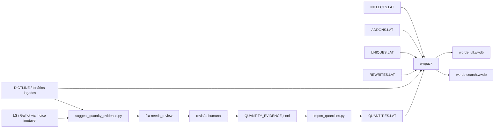
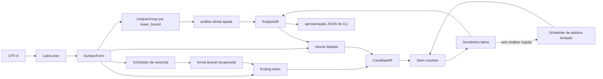
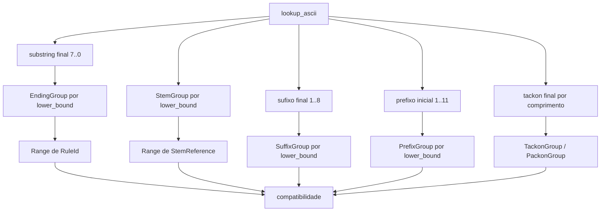
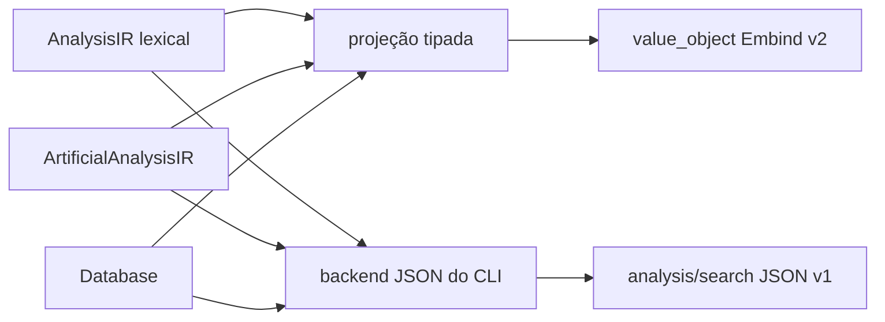

# Arquitetura da engine C++23 como compilador morfológico latino

## Estado

O inventário consolidado do que está implementado, testado e ainda pendente
está em [`estado-implementacao.md`](estado-implementacao.md). Esta página
permanece como especificação detalhada da arquitetura.

Este documento descreve a arquitetura adotada para a nova engine nativa e
WebAssembly. O primeiro corte vertical já existe no diretório raiz do projeto:

- valida e normaliza uma palavra latina em UTF-8;
- lê os perfis `dense` full e `search-only` do WWDB PoC;
- analisa as 11 classes semânticas regulares e as formas diretas de
  `UNIQUES.LAT`;
- aplica prefixos, sufixos, tickons, tackons e packons tipados de `ADDONS.LAT`;
- recupera perfeitos sincopados com regras tipadas de `REWRITES.LAT`;
- reproduz os truques ortográficos Ada com regras importadas e tipadas;
- devolve estruturas tipadas e permite ao CLI produzir JSON completo ou
  enxuto a partir da mesma IR;
- compara formas regulares e derivadas automaticamente com o executável Ada.

O perfil WWDB lido atualmente é uma ponte para usar os dados reais. Ele não é
o formato definitivo. A versão 1.8 contém todos os registros ativos de
`ADDONS.LAT`: 135 prefixos, incluindo seis tickons, 179 sufixos e 29 tackons,
dos quais 11 são packons, as 76 análises diretas de `UNIQUES.LAT` e 170 regras
de reescrita: 11 de síncope e 159 ortográficas. Ela acrescenta uma coluna de
quantidade para as 1.785 flexões e uma coluna esparsa de quantidade por
lexema/slot. No corte atual, há três regras flexionais e 76 alvos lexicais
curados. Ela ainda usa os bits reservados de lexemas PACK para identificar o
packon sem consultar meanings, permitindo que a projeção search funcione de
forma autônoma.

## Analogia de compilador

O latim não é uma linguagem de programação, mas a divisão de um compilador é
útil para organizar o analisador:

| Compilador | Engine latina |
| --- | --- |
| texto-fonte | palavra latina em UTF-8 |
| lexer | normalização Unicode e atributos das vogais |
| parser | enumeração de radical e terminação |
| tabela de símbolos | índice de radicais e lexemas |
| análise semântica | compatibilidade de classe, paradigma, chave e gênero |
| IR | candidato e análise morfológica tipados |
| backend | structs Embind ou apresentação JSON do CLI |

Não há AST sintática tradicional nem geração de código. Também não há uma VM
de regras: a engine é tabular e direcionada às estruturas do latim registradas
pelo Whitaker's WORDS.

## Fluxos

### Preparação dos dados



No marco atual, `wwdb_poc_pack.cpp` lê `DICTFILE.GEN`, `STEMFILE.GEN`,
`INFLECTS.SEC` e os registros humanos de `ADDONS.LAT`, `UNIQUES.LAT` e
`REWRITES.LAT` e o `QUANTITIES.LAT` gerado de evidências rastreáveis, e produz
`words-poc-dense.wwdb`. O
empacotador definitivo
deverá ler todas as fontes
humanas, validar seus campos e emitir os dois perfis relacionados pelo mesmo
`datasetId`.

### Consulta



O parser morfológico não interpreta expressões. Ele encontra todas as
terminações compatíveis, remove cada uma logicamente e consulta o radical
restante. A semântica decide quais combinações sobrevivem.

## Código e dados

A fronteira adotada é:

```text
código = normalizar, segmentar, comparar, limitar derivações e ordenar
dados  = lexemas, radicais, terminações, paradigmas, addons e quantidade
```

Ficam no código C++:

- normalização Unicode e equivalência ortográfica `i/j`, `u/v`;
- enumeração das terminações;
- significado dos campos e curingas do modelo Whitaker;
- compatibilidade de paradigma, stem key e gênero;
- scheduler derivacional legado, prioridades de reescrita e limites de
  composição;
- ordenação e projeção dos resultados;
- validação estrutural do banco.

Ficam nos arquivos de dados:

- quais lexemas e radicais existem;
- terminações e atributos flexionais;
- prefixos, sufixos, tackons e packons;
- formas irregulares e análises diretas de `UNIQUES.LAT`;
- substituições de síncope/ortografia e suas restrições semânticas;
- restrições de origem e atributos de destino dos addons;
- quantidade breve, longa ou desconhecida;
- frequência, época, proveniência e meanings.

Regras dinâmicas são registros tipados. Uma mudança de terminação ou de
paradigma não exige recompilar a engine. Uma operação semântica inteiramente
nova pode exigir uma nova versão do modelo C++ e do formato.

## Lexer Unicode

`LatinLexer` usa `utf8proc` e produz três representações:

```cpp
struct SurfaceForm {
    std::string original_utf8;
    std::string normalized_nfc;
    std::string orthography_ascii;
    std::string lookup_ascii;
    std::vector<VowelQuantity> quantities;
    std::vector<std::uint32_t> nfc_byte_offsets;
};
```

- `original_utf8` preserva a consulta válida como recebida;
- `normalized_nfc` é minúscula e canonicamente composta;
- `orthography_ascii` contém uma letra-base por posição, mas preserva `i/j` e
  `u/v` para que regras ortográficas possam distingui-las;
- `lookup_ascii` dobra `j -> i`, `v -> u` para o índice lexical legado;
- `quantities` alinha `unknown`, `short_vowel` ou `long_vowel` às letras-base;
- `nfc_byte_offsets` permite obter um intervalo lógico do texto NFC em O(1).

Antes do *case folding*, o lexer valida os escalares originais contra o
alfabeto latino aceito. Isso rejeita expansões ou equivalências Unicode que
produziriam ASCII sem serem grafias de entrada admitidas, como `ß -> ss`,
`K -> k` e `ſ -> s`. A superfície inteira é composta em uma única chamada NFC;
os offsets são então construídos avidamente por letra lógica, inclusive quando
uma letra NFC ainda ocupa base + marca combinante.

As marcas U+0304 e U+0306 são reconhecidas antes da composição. UTF-8 inválido,
marcas conflitantes, diacríticos não suportados e entradas que não sejam uma
palavra latina produzem erro de consulta.

O vetor de offsets incorpora a ideia útil de uma view UTF-8 com cache, mas é
construído avidamente porque o lexer já percorre toda a palavra. Não há cache
`mutable`, e os índices nunca sobrevivem à string proprietária.

O WWDB 1.7 informa quantidade de forma gradual. Uma marca confirmada recebe
`QuantityMatch::exact`; uma contradição elimina o candidato; posição ainda não
curada recebe `unknown`. Consultas sem marca continuam `unspecified`, sem
alterar candidatos ou ordem. Correspondências exatas são apresentadas antes
das desconhecidas somente em consultas marcadas.

## Snapshot do banco

```text
Database
├── vector<byte> image proprietária e imutável
├── string_view[] para pools dentro da imagem
├── LexemeRecord[]
├── InflectionRule[]
├── QuantityMask[] por RuleId, acesso O(1)
├── StemQuantityRecord[] esparso e ordenado por lexema/slot
├── StemReference[] + StemGroup[]
├── RuleId[] + EndingGroup[]
├── UniqueReference[] + UniqueGroup[]
├── PrefixRule[] + PrefixGroup[]
├── SuffixRule[] + SuffixGroup[]
├── TackonRule[] + TackonGroup[]
├── RewriteRule[] + pools de forma/meaning
└── AddonReference[] para o namespace único de AddonId
```

`Database::load_dense_poc` recebe ownership da imagem, valida tudo e somente
então publica `unique_ptr<const Database>`. O objeto é não copiável e não
movível, de modo que os `string_view` internos permanecem estáveis.

O loader verifica:

- magic, versão, perfil e tamanho declarado;
- CRC32 do payload;
- diretório, unicidade, limites, sobreposição e cobertura das seções;
- flags, stride e número de registros;
- pools de strings e IDs referenciados;
- bits reservados e intervalos de enums;
- monotonicidade e cobertura das tabelas de fronteira;
- invariantes das máscaras: `long` contido em `known`, largura, vogais,
  referências e ordem das chaves esparsas.

O marco aceita WWDB PoC 1.6 sem quantidades e 1.7 com ambas as seções no
perfil `dense` por linhas. Em 1.8, aceita tanto `dense` full quanto
`search-only` colunar; os demais perfis são rejeitados explicitamente, em vez
de serem interpretados por heurística.

## Índices

Os índices iniciais favorecem simplicidade e densidade:



Radicais são ordenados pela equivalência legada, sem copiar a string para cada
índice. Um grupo preserva todos os homógrafos e stem keys. Terminações apontam
para uma lista contígua de regras em ordem de `rule_id`.

Sufixos usam o mesmo modelo: no máximo oito consultas binárias por radical,
uma para cada comprimento observado. Cada `SuffixGroup` aponta para IDs
contíguos, preservando regras homônimas como as três transformações de `icul`.
Não se varrem 179 registros a cada candidato.

Prefixos são indexados da mesma forma, mas os `AddonId` candidatos são
reordenados pelo ordinal da fonte antes da avaliação. Isso preserva a
prioridade declarada em `ADDONS.LAT`: a engine aceita somente o primeiro
prefixo que produz uma análise semântica válida.

Tickons reutilizam o registro de prefixo, mas têm índice e caminho semântico
separados porque só precedem pronomes `qu-/cu-`. Tackons e packons compartilham
um registro compacto, porém permanecem em índices diferentes: o primeiro
reanálisa a palavra sem o fragmento pós-flexional; o segundo só admite lexemas
`PACK` cujo `required_packon` tipado referencia o mesmo `AddonId`. O ledger
`PACKON_REQUIREMENTS.LAT` materializa a antiga convenção editorial uma única
vez no pipeline; a engine não consulta nem interpreta meanings.

Com 48 mil grupos de radical, 460 terminações e 1.785 flexões, vetores ordenados
são um baseline adequado. Trie, hash aberto e MPHF só serão introduzidos se um
benchmark do WASM mostrar ganho material.

## IR e semântica

As fronteiras principais usam IDs fortes e intervalos em letras lógicas:

```cpp
struct CandidateIR {
    RuleId rule;
    SurfaceRange stem;
    SurfaceRange ending;
};

struct AnalysisIR {
    LexemeId lexeme;
    std::optional<RuleId> rule;
    std::uint8_t stem_key;
    SurfaceRange stem;
    SurfaceRange ending;
    Morphology morphology; // variante tipada para as 11 classes de análise
    QuantityMatch quantity_match;
    DerivationIR derivation; // addons fixos + forma reescrita opcional
};
```

`rule` é ausente para `UNIQUES`: cada linha dessa fonte já declara a
morfologia completa e não corresponde a uma regra produtiva. O loader mantém
todos os homógrafos em um `normalized_word -> span<UniqueReference>` ordenado
e anexa seus lexemas ao namespace denso usado pelo JSON search. O JSON completo
preserva o ordinal próprio de `UNIQUES` em `entryId`; o search publica o
`lexemeId` global e `ruleId: null`.

`CandidateIR` é agora a fronteira concreta entre enumeração e semântica. O
`Engine` primeiro avalia todos os candidatos regulares; somente quando nenhum
deles produz análise válida executa o scheduler de addons. Prefixos têm
precedência sobre sufixos. Na composição, remove-se operacionalmente o sufixo
e depois o prefixo, mas o caminho público é registrado como `prefix -> suffix`.
Tackons removem um fragmento posterior à flexão e precedem no caminho público
qualquer prefixo/sufixo encontrado ao reanalisar a base. Tickons são
publicados como `prefix`; packons permanecem `packon`. Nenhum resultado retorna
à mesma fila derivacional. Isso reproduz propriedades observadas no Ada:

- uma entrada regular tem precedência sobre formas imagináveis por addon;
- `anaticulus` e `anaticuliculus` recebem exatamente um passo `icul`;
- `anaticuliculiculus` permanece desconhecido;
- `archipuella` recebe um prefixo e `archipuellulus` recebe um prefixo seguido
  por um sufixo;
- `archiarchipuella` permanece desconhecido;
- `puellaque`, `anaticulusque` e `archipuellaque` preservam o tackon antes dos
  demais passos;
- `quidam` usa um packon, enquanto `ecquidam` usa `prefix -> packon`.

Se já há uma análise direta, o passe de enclíticos considera apenas `-que`,
que é a primeira entrada histórica. `-ne`, `-ve` e `-est` são tentados como
fallback. Essa assimetria evita análises artificiais como `be-ne` e `si-ne` e
faz parte do comportamento legado, embora as quatro entradas estejam na mesma
classe de dados.

O caminho derivacional tem capacidade fixa para as três categorias históricas
(prefixo, sufixo e tackon), portanto análises regulares não fazem alocação
adicional. Os IDs, e não textos, fazem parte da identidade e da deduplicação.

Síncope usa a mesma análise lexical, mas como uma fase de recuperação
controlada. O scheduler percorre apenas as prioridades existentes em
`REWRITES.LAT`, substitui uma ocorrência e submete a forma recuperada ao
pipeline lexical completo. O candidato só sobrevive se a análise for verbal e
usar a chave 3 do radical, como exige o perfeito. O primeiro grupo de
prioridade que produz resultado encerra a busca, reproduzindo o Ada sem
recursividade. Uma análise lexical direta pode coexistir; uma hipótese de
addon usada apenas como fallback é descartada quando a síncope validada é mais
forte.

`RewrittenFormIR` conserva `RewriteId` e uma cópia pequena do radical e da
terminação recuperados. A cópia é intencional: os `SurfaceRange` normais
referem-se à consulta original e não podem apontar para a string temporária da
reescrita. Assim, `amasti` publica `amav + isti` e um passo
`perfect-v-contraction`, em vez de fingir uma segmentação da superfície.

Ortografia usa a mesma infraestrutura, com dois estágios que correspondem ao
controle histórico: `early` para `Try_Slury` quando a análise lexical inicial
falha, e `fallback` para `Try_Tricks` depois de esgotar os caminhos normais. As
operações são um enum fechado (`literal`, `slur` e `double_consonant`), não uma
VM. O scheduler percorre somente prioridades presentes e para no primeiro
grupo que produz uma análise semanticamente válida.

`RewrittenFormIR` guarda até dois `RewriteId`: uma correção ortográfica pode
ser seguida por uma síncope, mas o resultado não volta à fila. Tackons podem
preceder esse caminho e continuam no array fixo de addons; um contador registra
quantos passos devem ser serializados antes das reescritas. Esse limite
reproduz os caminhos artificiais observados sem introduzir recursividade geral.
As substituições são feitas por offsets lógicos na superfície NFC, portanto um
mácron fora do trecho alterado é preservado.

## Entrada de dois tokens e compostos verbais

`Engine::analyze_text` aceita uma palavra ou, neste corte, exatamente dois
tokens para a gramática fechada de `Compounds_With_Sum`. O primeiro token é
analisado pelo pipeline completo; o segundo precisa ser uma forma finita de
`sum`, `esse`, `fuisse` ou `iri`. A composição admite:

- particípio perfeito passivo ou futuro ativo/passivo, nominativo e com o
  mesmo número de uma forma finita de `sum`;
- os mesmos particípios nas construções infinitivas licenciadas por
  `esse`/`fuisse`;
- supino acusativo antes de `iri`.

`CompoundAnalysisIR` referencia o lexema, a regra e a derivação que licenciaram
o primeiro token, mas guarda separadamente a morfologia verbal calculada e o
auxiliar. Isso evita inventar um `RuleId` persistente para a forma sintética.
O backend completo publica `method: compound`; o search conserva a regra de
origem e acrescenta `compound.construction` e `compound.auxiliary`.

Frases gerais e entradas com mais de dois tokens retornam erro explícito. O
`LatinLexer` continua sendo um lexer de palavra, sem whitespace ou estado de
frase.

Também não se deve confundir este caminho com `Tricks.Two_Words`. O porte dessa
rotina é uma recuperação opcional de **uma** grafia concatenada, habilitada por
`AnalysisOptions::two_words = TwoWordsMode::legacy_first_match`. Ela só roda
quando léxico, addons, síncope, ortografia e numerais não produziram resultado.
Cada corte chama diretamente o núcleo lexical, de modo que não há recursão nem
reescritas dentro dos segmentos. O primeiro corte válido vence, com os limites
legados de duas letras à esquerda e três à direita e a mesma lista de onze
prefixos comuns bloqueados.

Como o próprio help Ada alerta que a hipótese costuma ser falsa,
`TwoWordSuggestionIR` não entra em `analyses`: guarda duas `WordSegmentIR`, cada
uma com superfície e análises próprias, enquanto a consulta permanece
`status: unknown`. Os JSONs completo e search publicam o agrupamento opcional
em `suggestions`; o vetor principal continua vazio. Mácrons são cortados por
índice lógico NFC, nunca por byte. A opção permanece desligada por padrão e o
CLI a expõe como `--two-words=legacy`.

No corte implementado, a semântica de substantivos confirma:

1. regra e lexema são substantivos;
2. stem key é igual, ou a chave lexical zero aceita as chaves 1/2 legadas;
3. `(0,0)` e variante zero da regra funcionam como curingas documentados;
4. gênero exato, `X` ou `C` é compatível segundo o comportamento Ada;
5. caso e número vêm da flexão;
6. declinação, variante e gênero final vêm do lexema.

Para adjetivos, uma `AdjectiveMorphology` separada acrescenta o grau. O loader
decodifica `X/POS/COMP/SUPER`; a semântica exige graus compatíveis e, quando o
lexema usa `X`, deriva `positive/comparative/superlative` da chave lexical como
faz o Ada. O gênero pertence à flexão, não ao lexema adjetival.

`PronounMorphology` cobre o mesmo núcleo nominal de caso, número e gênero. O
corte atual implementa os pronomes regulares e o caminho especial `qu-/cu-`
usado por tickons/packons.

As demais classes do dataset geral também têm IR explícito:

- `NumeralMorphology` acrescenta `NumeralType`; quando o lexema traz `X`, o
  tipo cardinal/ordinal/distributivo/adverbial é derivado da chave 1/2/3/4;
- `AdverbMorphology` contém o grau, igualmente derivado da chave quando o
  dicionário traz `X`;
- `VerbMorphology` contém conjugação, tempo, voz, modo, pessoa e número;
- `ParticipleMorphology` e `SupineMorphology` mantêm o lexema verbal, mas
  publicam as propriedades próprias da regra efetiva;
- `PrepositionMorphology` contém o caso regido;
- `InvariableMorphology` representa conjunções e interjeições sem inventar
  campos vazios no modelo.

Sufixos cujo alvo é numeral, advérbio ou verbo reutilizam exatamente os mesmos
tipos. `binteni`, `boniter` e `amesco` exercitam esses três caminhos. O perfil
WWDB 1.3 já continha todos os bits necessários para essas classes. O WWDB 1.4
acrescenta somente a seção `uniques`, com registros densos de 12 bytes no
perfil completo: `surface_id:u16`, `meaning_id:u16` e 64 bits de classe,
paradigma, morfologia, metadados e reserva.

O WWDB 1.5 introduziu `rewrite_strings`, `rewrite_meanings` e `rewrites`. O
WWDB 1.6 amplia cada registro para 16 bytes no perfil completo (14 no
`search-only`) e adiciona operação, estágio e restrição especializada. Há 170
registros: 11 regras manuais de síncope e 159 regras ortográficas geradas das
tabelas Ada. O payload mantém espécie, escopo, prioridade, direção,
classe/chave exigidas, limites de contexto e época; não há interpretador
genérico de opcodes.

Uma entrada única tem precedência sobre tentativas produtivas de prefixo e
sufixo, mas não elimina homógrafos regulares. Tackons podem reanalisar uma base
única, como em `mavisque`; o método público continua `unique`, com o tackon em
`steps`. Essa separação reproduz a intenção do Ada sem transformar associações
acidentais de sua montagem de listas em regras linguísticas.

`POS` significa **grau positivo**, não polaridade. Não há campo `polarity` no
layout Ada, no WWDB PoC, no schema canônico nem em `LatinaeTabulae.ods`.
Negação aparece hoje como semântica de prefixos como `in-`, `ne-` e `non-` em
`ADDONS.LAT` e já é preservada como meaning de um passo derivacional. Uma
polaridade lexical independente só deve entrar no modelo quando uma fonte
enriquecida realmente a fornecer.

Após gerar candidatos, a engine usa `std::ranges::sort` seguido de
`std::ranges::unique` para eliminar regras semanticamente duplicadas de forma
determinística, preservando o menor `RuleId`. Isso reproduz casos como
`fortis` sem introduzir uma busca quadrática no caminho comum.

Novas classes de fontes futuras não devem gerar resultado parcial. Se um
candidato ainda não implementado passar pelas compatibilidades comuns de
classe efetiva, stem key e paradigma, a consulta retorna
`unsupported-part-of-speech`. Sem candidato ligado, retorna `unknown`.

Extensões semânticas devem continuar como funções tipadas:

```cpp
bool matches_noun(...);
bool matches_verb(...);
```

Não se deve substituir essas funções por opcodes genéricos sem evidência de
que as tabelas tipadas são insuficientes.

## Backends



A engine e o adaptador WebAssembly retornam estruturas. A projeção `search`
resolve `lemma`, classe, morfologia, propriedades/metadados lexicais e flags da
regra, além de `lexemeId`, `ruleId`, `addonIds`, `rewriteIds` e `scoreFlags`;
ela não toca no pool de meanings. `analyze` usa a mesma forma tipada e
acrescenta `meaning` quando o WWDB é full. Presença é representada por booleano
explícito no C++ e por `null`/campo ausente na wrapper, nunca por ID sentinela.

`src/json.cpp` pertence à biblioteca separada `words_json`, ligada pelo CLI e
pelos testes de aceitação. `words_core` e o binário WebAssembly não compilam
nem ligam `nlohmann_json`; JSON é apresentação, não representação interna nem
ABI da engine.

Para Unicode:

- `query.text` preserva a entrada;
- `query.normalized` usa NFC;
- `form.stem` e `form.ending` vêm da superfície NFC;
- `lookup_ascii` e `QuantityMatch` permanecem internos na versão 1.

## API e CLI atuais

```cpp
Engine::create(std::vector<std::byte>, EngineConfig)
    -> std::expected<std::unique_ptr<const Engine>, LoadError>;

Engine::analyze(std::string_view) const
    -> QueryResult;

Engine::analyze_text(std::string_view) const
    -> QueryResult;
```

`analyze` permanece a via sem ambiguidade para uma palavra. `analyze_text`
tokeniza somente whitespace ASCII, delega uma palavra a `analyze` e limita a
entrada composta a dois tokens; não promete análise sintática de uma oração.

`EngineConfig` exige um `datasetId` no formato `sha256:`. O PoC ainda não
armazena esse valor, portanto ele é fornecido pelo host.

O CLI nativo é:

```text
words_cli --database FILE --dataset-id sha256:... \
          --format analysis|search LATIN_TEXT
```

Consultas de dois tokens devem ser passadas como um único argumento quoted,
por exemplo `"amata est"`.

Para testes de corpus, `--batch-json-lines` lê uma consulta não vazia por linha
de `stdin` e escreve um documento JSON por linha. O processo carrega um único
snapshot imutável e o reutiliza no lote; esse modo existe para aceitação e
benchmark, não altera a API semântica nem cria estado entre consultas.

Falha de uso ou carregamento pertence ao status do processo. Uma consulta
inválida produz um documento JSON com `status:error`.

O marco pode ser construído e validado a partir da raiz com:

```sh
cmake -S . -B build -G Ninja -DCMAKE_BUILD_TYPE=Debug
cmake --build build
ctest --test-dir build --output-on-failure
```

## C++23 e CppCoreGuidelines

As convenções adotadas são:

- RAII para toda memória e recurso;
- nenhum `new/delete` exposto pela API;
- `unique_ptr<const T>` para snapshots publicados;
- `std::span` e `std::string_view` somente como views de owners estáveis;
- `std::expected` nas fronteiras falíveis de lexer, loader e criação;
- `enum class` e IDs fortes em vez de inteiros intercambiáveis;
- conversões estreitas verificadas antes de `static_cast`;
- `std::out_ptr` somente na fronteira C de `utf8proc_map`;
- classes apenas quando há ownership ou invariantes;
- ausência de hierarquia virtual entre fases;
- algoritmos `std::ranges` quando deixam ordem e lifetime claros;
- warnings como erro e ASan/UBSan nos builds de desenvolvimento.

O loader usa exceção apenas internamente para abortar uma validação profunda e
converte-a em `std::expected<..., LoadError>` na fronteira pública. Nenhuma
exceção atravessará futuramente a ABI C/WASM.

## Organização inicial

```text
include/words/
├── model.hpp
├── lexer.hpp
├── database.hpp
├── engine.hpp
└── json.hpp

src/
├── artificial.cpp
├── model.cpp
├── lexer.cpp
├── database.cpp
├── engine.cpp
├── json.cpp
└── main.cpp

tests/
├── lexer_test.cpp
├── database_test.cpp
├── engine_test.cpp
├── differential_test.py
└── corpus_differential_test.py
```

Há um único target `words_core` enquanto o projeto é pequeno. O CLI depende do
core; testes dependem do core e do GTest. A separação em mais bibliotecas será
feita somente quando existir uma fronteira de build ou reutilização real.

`artificial.cpp` contém reconhecedores algorítmicos que não são tabelas
lexicais. A gramática de numeral romano pertence ao código porque define como
interpretar a notação, inclusive o dialeto aditivo aceito pelo Ada; não é uma
lista editorial que varie por dataset. Já as substituições de síncope e
ortografia recebem IDs tipados e vêm da seção de regras/configuração do WWDB,
pois são repertórios extensíveis e precisam ser projetáveis no JSON search. A
síncope e ortografia já seguem esse caminho. O importador determinístico das
tabelas Ada também é verificado pelo teste diferencial, para que a fonte
tipada não derive silenciosamente do legado.

## Verificação atual

Os testes cobrem:

- ASCII, NFC/NFD, caixa, mácron, breve e UTF-8 inválido;
- compilação determinística de `QUANTITY_EVIDENCE.jsonl`, retenção de
  evidência provável, rejeição de fonte auxiliar promovida e conflito fatal
  entre testemunhos confirmados;
- geração determinística e estritamente `needs_review` de candidatos de
  Lewis & Short/Gaffiot, com fixtures de homógrafos, filtro por POS/gênero,
  capitalização, cortes editoriais, marcas fora do radical, conflitos de
  quantidade e supressão de pares fonte/alvo já registrados;
- carga e comparação triestado das máscaras flexionais e lexicais, incluindo
  `rosā`/`rosă` e a partição `mālum`/`mălum`;
- corrupção do header, perfil, truncamento e CRC;
- lookup real de radical e terminação;
- carga, validação e índices dos 135 prefixos, 179 sufixos e 29 tackons/packons;
- carga, validação e índice exato das 76 entradas de `UNIQUES.LAT`, preservando
  homógrafos e `ruleId: null`;
- carga e validação das 170 micro-regras; recuperação sincopada por prioridade
  de `amasti`, `amarunt`, `audisti` e `audiisti`;
- famílias ortográficas inicial, interna, medieval, assimilação e consonante
  dupla, incluindo composição ortografia -> síncope, tackon -> ortografia e
  preservação de mácron fora do trecho reescrito;
- compostos finitos com formas ambíguas de `sum`, infinitivos com
  `esse`/`fuisse` e supino + `iri`, além da rejeição de frases gerais;
- semântica tipada das 11 classes de análise: substantivo, pronome, adjetivo,
  numeral, advérbio, verbo, particípio, supino, preposição, conjunção e
  interjeição;
- schemas `analysis-v1` e `search-v1`;
- equivalência completa com o Ada para consultas regulares de todas essas
  classes e para casos derivados por prefixo, sufixo, tackon, packon, tickon e
  composições representativas, incluindo os alvos de sufixo numeral, advérbio
  e verbo e seus limites não recursivos;
- regressões positivas de `rosa`, `rosae`, `forte` e `quis`, que antes eram
  bloqueadas para impedir resultados parciais;
- apresentação NFC de `puellā` recebida em NFD;
- equivalência byte a byte com o Ada para formas únicas isoladas, homógrafos
  regulares + únicos e tackon sobre unique nas fixtures permanentes. Uma
  varredura das 76 linhas confirmou o conteúdo de todas as análises diretas;
  as diferenças de envelope restantes pertencem às associações históricas de
  addons ainda não classificadas;
- numerais romanos estritos, grafias aditivas históricas, fallback malformado,
  coexistência com homógrafos e composição com enclítico. O IR artificial fica
  separado do vetor lexical e o search usa `lexemeId: null`.
- equivalência diferencial com o Ada para síncope e para fixtures das famílias
  ortográficas, inclusive com enclítico. A única diferença aceita é
  intencional: o exportador Ada legado perde os marcadores `Yyy`/`Xxx` e
  escreve `regular`; o nativo preserva o método, os passos e `rewriteIds`.
- equivalência diferencial dos compostos com `sum`; o nativo corrige duas
  perdas de apresentação do exportador Ada, preservando a consulta normalizada
  completa e o passo `compound`.
- equivalência diferencial de `Two_Words` para fronteira e conteúdo lexical;
  o Ada achata os segmentos como sucesso, enquanto o contrato nativo os mantém
  agrupados como sugestão de baixa confiança.
- aceitação sobre as 2.726 formas ASCII distintas da Eneida IV usada pelos
  testes históricos. O harness em JSON Lines mantém uma instância de cada
  engine, valida os 2.726 envelopes `analysis` do Ada e do C++ e também os
  2.726 envelopes `search` nativos contra os schemas;
- nessa varredura, 2.630 formas são idênticas, 41 diferem apenas na proveniência
  tipada, 41 têm o mesmo conjunto semântico e 14 são diferenças nativas
  explicitamente aceitas. As antigas 33 diferenças de compatibilidade foram
  revisadas: os falsos caminhos produtivos foram corrigidos e os casos em que a
  análise nativa é deliberadamente diferente foram promovidos ao manifesto. O
  conjunto de diferenças de compatibilidade pendentes está vazio; uma
  divergência nova ou que mude de relação faz o teste falhar;
- relação entre as duas projeções no mesmo corpus: o JSON `search` preserva
  consulta/status e passa seu schema, ocupando aproximadamente 1,38 MB contra
  7,91 MB dos envelopes completos no build atual;
- regressões focadas para a prioridade de enclítico em `aequataque`, exposição
  pública da quarta conjugação em `audiam`, reconhecimento de `aliquis` e
  deduplicação dos packons de `cuique`.

## Próximas etapas

1. revisar por lotes os candidatos de `prepare_lexeme_review.py` e versionar
   somente decisões editoriais fixadas a `draft_id + revision`; validador,
   compilador `accept_new → LEXEMES.LAT` e importação full/search já estão
   implementados;
2. medir o primeiro lote curado dentro do limite estreito e migrar somente as
   contagens/fronteiras de radical que precisarem de `u32`;
3. habilitar o perfil full colunar no loader e comparar startup/heap com o
   perfil por linhas; detalhes em
   [`compressao-ids-e-ordem.md`](compressao-ids-e-ordem.md);
4. revisar por lotes a fila produzida por `suggest_quantity_evidence.py`,
   ampliar `QUANTITY_EVIDENCE.jsonl` somente com locators confirmados e
   estender o mesmo modelo a addons/uniques;
5. medir startup, memória e latência no navegador antes de trocar os índices;
6. criar ABI C somente se surgir consumidor que não possa usar o adaptador
   WebAssembly/Embind já implementado.

## Decisões adiadas

Não fazem parte da arquitetura necessária atualmente:

- VM ou microcódigo semântico;
- linguagem genérica de regras e AST própria;
- linker de módulos com override e prioridades;
- hot reload concorrente;
- SoA colunar como layout obrigatório em memória;
- `std::pmr` para palavras curtas;
- trie, hash aberto, MPHF ou prefetch manual.

Esses itens só devem voltar à proposta mediante um requisito concreto ou uma
medição que não possa ser atendida pelo modelo tabular latino.
