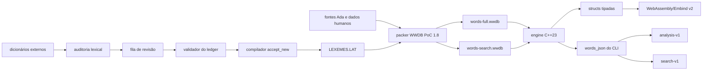

# Estado atual da implementação

Data do snapshot: 2026-08-29.

Este documento é o índice operacional do projeto. Ele registra o que já está
implementado e testado, o que existe apenas no pipeline de preparação dos
dados e o que ainda não deve ser considerado pronto. Os documentos temáticos
continuam sendo a referência para detalhes de formato e algoritmos.

## Resumo executivo

A engine nativa C++23 já executa um corte vertical completo: recebe latim em
UTF-8, normaliza quantidade vocálica, consulta um snapshot WWDB imutável,
reproduz os caminhos morfológicos relevantes do Words Ada e devolve IR tipada.
O CLI pode apresentá-la como JSON canônico completo ou JSON enxuto de busca.

Esse mesmo corte já é compilado para WebAssembly. A fronteira Embind recebe o
WWDB como `Uint8Array`, conserva-o no snapshot C++ e devolve `value_object`s e
vetores registrados, sem JSON, allocator ou ponteiros públicos. O wrapper de
navegador e o procedimento de publicação estão em
[`webassembly-browser.md`](webassembly-browser.md).
As regras de versionamento, artefatos regeneráveis e publicação por tag estão
em [`repositorio-e-releases.md`](repositorio-e-releases.md).

Os bancos atuais são duas projeções WWDB PoC 1.8 dos mesmos dados legados:
`words-full.wwdb`, com significados, e `words-search.wwdb`, sem textos
editoriais. A arquitetura de
revisão para enriquecimento lexical já existe — auditoria, fila, schemas e
validador de decisões —, e agora inclui o compilador `accept_new →
LEXEMES.LAT` e a importação opcional pelo packer. Nenhum lexema externo foi
promovido ao snapshot oficial porque ainda não existe um
`LEXEME_DECISIONS.jsonl` curado; `LEXEMES.LAT` é uma projeção regenerável e
deliberadamente ausente nesse caso.

Todas as setas representam caminhos implementados. A ausência de uma decisão
humana válida produz zero lexemas novos, não uma promoção automática.

## Engine C++23 implementada

### Entrada e Unicode

O [`LatinLexer`](../../include/words/lexer.hpp) e sua implementação em
[`src/lexer.cpp`](../../src/lexer.cpp) fazem:

- validação de UTF-8 antes de qualquer case folding;
- allowlist de letras latinas ASCII, mácron e breve, precompostos ou
  combinantes;
- normalização NFC para apresentação e forma ASCII separada para lookup;
- conversão legada `j → i` e `v → u` somente na chave de consulta;
- vetor de quantidade por letra lógica, com `long`, `short` ou `unknown`;
- offsets de letras lógicas independentes de bytes UTF-8;
- rejeição de marcas em consoantes, marcas duplicadas/conflitantes,
  diacríticos não suportados, `ß` e caracteres que só virariam ASCII por case
  folding.

A implementação usa diretamente `utf8proc`. O `simple_utf8view.hpp` estudado
como referência não foi incorporado porque o lexer precisa de validação,
normalização e atributos latinos específicos, não de uma abstração UTF-8
genérica.

### Banco e ownership

O [`Database`](../../include/words/database.hpp) recebe ownership do container
em `std::vector<std::byte>` e só publica `std::unique_ptr<const Database>` após
validar o arquivo inteiro. O snapshot é não copiável e não movível; seus
`std::string_view` e `std::span` permanecem ligados à imagem proprietária.

O loader implementado confere magic, versão, perfil, tamanhos, CRC32,
diretório de seções, strides, cobertura, sobreposição, IDs, enums, bits
reservados, pools e ordenação dos índices. Ele mantém compatibilidade com o
perfil denso por linha WWDB 1.6/1.7, aceita `dense` e `search-only` no WWDB
1.8 e rejeita explicitamente os demais perfis. O perfil enxuto não possui
pools de significados e, por isso, só autoriza busca tipada ou sua apresentação
CLI `search-v1`.

Os índices em memória são vetores ordenados consultados com algoritmos de
ranges e retornam views não proprietárias. Não há árvore de nós, ownership
compartilhado ou estado global mutável. Trie, MPHF, hash aberto e `std::pmr`
continuam adiados até existir benchmark que os justifique.

### Morfologia e caminhos de análise

A engine cobre:

- as classes regulares: substantivo, pronome/packon, adjetivo, numeral,
  advérbio, verbo, particípio, supino, preposição, conjunção e interjeição;
- entradas diretas de `UNIQUES.LAT` e sua coexistência com homógrafos
  regulares;
- prefixos, sufixos, tickons, tackons e packons tipados;
- composição limitada de prefixo + sufixo e de enclítico sobre caminhos já
  aceitos;
- síncope do perfeito e reparos ortográficos dirigidos por `REWRITES.LAT`;
- numerais romanos estritos, variantes históricas e fallback permissivo
  marcado;
- gramática fechada de dois tokens para particípio/supino + formas de
  `sum`, `esse`, `fuisse` e `iri`;
- sugestão opt-in `Two_Words`, limitada e separada do resultado analisado;
- quantidade vocálica de flexão e de radical, sem alterar o comportamento
  legado quando a entrada não traz marca.

Os caminhos produtivos são deliberadamente limitados; não há recursão
irrestrita de sufixos como `anaticuliculiculus`. A engine mantém a proveniência
do caminho no IR, inclusive onde o exportador Ada histórico a perdia.

### API, CLI e JSON

[`Engine`](../../include/words/engine.hpp) é construída por factory que retorna
`std::expected<std::unique_ptr<const Engine>, LoadError>`. A consulta principal
recebe `std::string_view` e devolve IR proprietário; views da base só são
expostas com anotação de lifetime quando suportada pelo compilador.

O executável `words_cli` suporta:

- `--format analysis` para o contrato completo;
- `--format search` para a projeção enxuta;
- `--two-words=legacy` como recuperação opt-in;
- `--batch-json-lines` para corpus sem recarregar a base a cada palavra.

Os contratos são fechados e separados:

- [`analysis-v1.schema.json`](../../schemas/analysis-v1.schema.json):
  morfologia, lexema, significado e derivação;
- [`search-v1.schema.json`](../../schemas/search-v1.schema.json): resultado
  compacto para busca, sem definições completas.

O JSON de revisão editorial não é misturado com nenhum desses contratos.

### Navegador e WebAssembly

[`wasmsrc/main.cpp`](../../wasmsrc/main.cpp) publica uma classe Embind
`AnalysisEngine`. O load do banco é transacional, aceita `Uint8Array` e não
expõe `_malloc`, `_free` ou a heap ao host. `analyze` e `search` recebem texto
UTF-8 e devolvem structs tipadas versão 2. `search` resolve lema, classe,
morfologia e flags sem carregar meanings; `analyze` acrescenta meaning no
perfil full.

[`wasmsrc/words-engine.mjs`](../../wasmsrc/words-engine.mjs) resolve o módulo,
busca ou recebe o WWDB, copia/libera os vetores Embind e controla descarte. O
build Emscripten gera ES modules para browser, Worker e Node, TypeScript de
baixo nível e, quando as ferramentas existem, variantes Brotli/Gzip.

`words_core` não contém o backend JSON nem depende de `nlohmann_json`.
`src/json.cpp` é compilado na biblioteca nativa separada `words_json`, usada
somente pelo CLI e pelos testes de apresentação. O WASM Release medido ocupa
772.792 bytes RAW, 146.376 em Brotli 11 e 212.798 em gzip 9.

## Dados compactos implementados

O packer PoC em
[`wwdb_poc_pack.cpp`](../poc/compact-db/wwdb_poc_pack.cpp) produz quatro perfis
para medição: `simple`, `dense`, `columnar` e `search-only`. O runtime atual lê
`dense` por linhas e `search-only` diretamente em colunas, sem reconstruir um
array intermediário de registros.

O WWDB PoC 1.8 full possui 23 seções e inclui:

- 39.339 registros lexicais legados;
- 62.086 referências de radical;
- 1.785 regras de flexão;
- 135 prefixos, incluindo seis tickons;
- 179 sufixos;
- 29 tackons, dos quais 11 são packons;
- 76 análises diretas de `UNIQUES.LAT`;
- 170 regras tipadas de reescrita: 11 de síncope e 159 ortográficas;
- quantidade para as flexões e uma tabela esparsa por lexema/slot.

A versão 1.8 também grava no payload lexical PACK a identidade tipada do
packon requerido. A engine não precisa mais inferir `-cum`, `-cumque`,
`-que` etc. do texto inglês; isso torna o banco search independente dos
significados. A projeção search conserva os mesmos IDs, regras, índices e
quantidades em 18 seções, omitindo os cinco pools/IDs editoriais.

Tamanhos medidos no snapshot atual:

| Perfil | RAW | gzip -9 | zstd -19 |
| --- | ---: | ---: | ---: |
| simples | 2.977.659 | 1.339.354 | 1.160.544 |
| denso por linhas | 2.731.900 | 1.251.212 | 1.091.956 |
| denso por colunas | 2.731.900 | 1.042.735 | 880.996 |
| search-only | 1.200.341 | 416.259 | 359.459 |

Para a distribuição web real, o exportador Node 22 mediu:

| Artefato | RAW | Brotli 11 (`.br`) | gzip 9 (`.gz`) |
| --- | ---: | ---: | ---: |
| `words-full.wwdb` | 2.731.900 | 1.009.235 | 1.251.212 |
| full colunar experimental | 2.731.900 | 841.556 | 1.042.735 |
| `words-search.wwdb` | 1.200.341 | 340.452 | 416.259 |

Brotli e gzip são representações HTTP do mesmo arquivo, não novos formatos de
banco. O navegador negocia `Content-Encoding` e entrega ao loader os bytes
WWDB descomprimidos. A release prioriza Brotli com fallback gzip; Zstd pode ser
uma terceira representação negociada, mas ficou maior que Brotli neste banco.
O detalhamento por seção, IDs e alternativas está em
[`compressao-ids-e-ordem.md`](compressao-ids-e-ordem.md).

Esses números são resultados do PoC, não promessa do container final. O
formato e os hashes estão documentados em
[`poc/compact-db/README.md`](../poc/compact-db/README.md).

## Pipeline de dados implementado

### Reescritas

[`import_ada_rewrites.py`](../poc/compact-db/import_ada_rewrites.py) importa as
tabelas ortográficas Ada para micro-regras tipadas em `REWRITES.LAT` e possui
modo `--check` para detectar divergência da fonte.

### Quantidade vocálica

[`import_quantities.py`](../poc/compact-db/import_quantities.py) valida
`QUANTITY_EVIDENCE.jsonl` e gera `QUANTITIES.LAT` deterministicamente.

[`suggest_quantity_evidence.py`](../poc/compact-db/suggest_quantity_evidence.py)
lê fontes externas em modo somente leitura e produz apenas sugestões
`needs_review`. A política implementada é:

- vogal sem marca permanece desconhecida;
- duas famílias independentes concordantes formam consenso;
- oposição explícita vira conflito, nunca maioria;
- Collatinus é evidência derivada e não conta como voto independente.

O banco atual contém três regras flexionais e 76 alvos lexicais curados. A
auditoria detalhada está em
[`revisao-fila-quantidades.md`](revisao-fila-quantidades.md).

### Auditoria de ampliação lexical

[`audit_lexical_expansion.py`](../poc/compact-db/audit_lexical_expansion.py)
mede cobertura sem alterar o Words ou as fontes externas. Ele:

- agrupa por lema ASCII, POS e próprio/comum;
- separa fontes independentes de derivadas;
- aprende mapas conservadores de paradigmas externos usando entradas Words já
  cobertas;
- resolve radicais herdados do Collatinus;
- valida radicais propostos contra `INFLECTS.SEC` e formas do léxico
  Latim–Alemão;
- emite rascunhos estruturais, nunca entradas canônicas.

Resultados do núcleo:

- 49.661 grupos tipados comparáveis;
- 25.116 estruturalmente ausentes;
- 5.730 ausentes corroborados por duas ou mais famílias independentes;
- 2.030 comuns com POS explícito em duas famílias;
- 66 rascunhos com estrutura completa, dos quais 65 validados por formas.

Com Faria v3, há 80 rascunhos estruturais, 77 validados por formas. A contagem
completa está em
[`auditoria-ampliacao-lexical.md`](auditoria-ampliacao-lexical.md).

### Fila e decisões editoriais

[`prepare_lexeme_review.py`](../poc/compact-db/prepare_lexeme_review.py) converte
os rascunhos em uma fila determinística. Cada candidato recebe `draft_id`,
revisão SHA-256, evidência semântica e quantitativa e, opcionalmente, um
baseline `analysis-v1` da engine. Todos permanecem com
`automatic_promotion_allowed = false`.

Nos 66 candidatos do núcleo:

- 58 podem avançar para redação editorial;
- `decimus` e `summus` devem ser mesclados, não duplicados;
- `fidele` ainda depende de revisão estrutural;
- `oleagineus`, `vestiarius`, `furens`, `galbaneus` e `scirpeus` exigem
  revisão de identidade/reclassificação;
- seis lemas têm conflito quantitativo em ao menos uma posição.

Os schemas editoriais implementados são:

- [`lexeme-review-candidate-v1.schema.json`](../../schemas/lexeme-review-candidate-v1.schema.json);
- [`lexeme-editorial-decision-v1.schema.json`](../../schemas/lexeme-editorial-decision-v1.schema.json).

[`validate_lexeme_decisions.py`](../poc/compact-db/validate_lexeme_decisions.py)
valida o ledger contra a fila exata. Ele bloqueia revisão obsoleta, IDs ou
sentidos duplicados, alterações silenciosas da estrutura, proveniência
inexistente, referências quantitativas não resolvidas, merge incompatível com
o baseline e colisões entre novas entradas aceitas. Ledger parcial é válido;
o relatório separa candidatos decididos, resolvidos, adiados e ainda não
revisados.

[`compile_lexemes.py`](../poc/compact-db/compile_lexemes.py) repete a validação
do ledger e compila somente decisões `accept_new` em registros JSONL numéricos
`whitakers-words.compiled-lexeme.v1`. A ordem é canônica e não depende da ordem
do ledger. O packer lê `LEXEMES.LAT` quando presente, acrescenta os lexemas e
suas referências ao mesmo espaço de IDs do full e do search, e rejeita
colisões estruturais ou overflow antes de escrever o banco. Sem o arquivo, os
WWDB continuam byte a byte idênticos ao snapshot legado.

A política de fontes, os 66 casos e o contrato da decisão estão em
[`revisao-editorial-lexemas.md`](revisao-editorial-lexemas.md).

## Verificação existente

A suíte contém testes unitários C++, testes dos geradores Python, validação dos
schemas, comparação diferencial com o Ada e aceitação de corpus.

O corpus histórico da Eneida IV possui 2.726 formas ASCII distintas. No corte
documentado, 2.630 envelopes são idênticos ao Ada, 41 diferem somente na
proveniência tipada, 41 têm o mesmo conjunto semântico e 14 diferenças nativas
estão explicitamente justificadas. Não há divergência de compatibilidade não
classificada no manifesto.

As regressões cobrem, entre outros pontos:

- todas as classes semânticas regulares;
- addons e limites de composição;
- uniques, homógrafos e numerais romanos;
- síncope, reparos ortográficos e enclíticos;
- compostos com `sum` e sugestões `Two_Words`;
- UTF-8 válido/inválido, NFC/NFD, mácron, breve e rejeição de `ß`;
- separação de homógrafos por quantidade, incluindo `malum`;
- importação e sugestão de quantidades;
- auditoria lexical, fila editorial e validação do ledger;
- compilação determinística, importação full/search, colisão com o legado,
  precedência sobre `Two_Words` e overflow explícito do perfil `u16`;
- contrato Embind sem JSON, inclusive `amamus → amo` com flags verbais, e
  ausência de meaning na busca full/search.

## Limites e trabalho ainda não implementado

Os itens seguintes permanecem pendentes:

1. revisar e versionar decisões editoriais reais para o primeiro lote;
2. acrescentar máscaras de quantidade por slot ao microformato antes de
   promover homógrafos novos cuja identidade dependa somente de longa × breve;
3. migrar contagens/offsets de referências de radical para `u32`: o índice
   `u16` já usa 62.086 posições e só deixa 3.449 livres;
4. estabilizar o formato além do PoC e habilitar o perfil full colunar no
   loader; ele economizou 167.679 bytes em Brotli 11 sem renumerar IDs;
5. decidir, com benchmarks de startup e heap, se delta de referências merece
   uma nova codificação de seção;
6. definir uma ABI C estável somente se surgir consumidor que não possa usar
   a interface Embind já implementada;
7. medir startup, memória, latência e tráfego em navegadores/dispositivos
   reais;
8. implementar leitura nativa do perfil experimental `simple` somente se ele
   ainda tiver utilidade medida.

Não estão planejados sem uma necessidade medida: VM genérica, linguagem de
microcódigo arbitrária, AST sintática geral, hot reload concorrente, trie,
MPHF ou alocação PMR para palavras curtas.

## Ordem recomendada para continuar

O próximo corte deve ser pequeno e verificável:

1. criar o primeiro `LEXEME_DECISIONS.jsonl` com decisões de baixa ambiguidade;
2. compilar o ledger e manter candidatos não decididos visíveis no relatório;
3. gerar os dois WWDB e revisar o diff de IDs/tamanho do lote real;
4. habilitar o full colunar no loader sem alterar o espaço lógico de IDs;
5. só então versionar uma largura maior ou delta para o índice de radicais;
6. medir o artefato enriquecido no navegador antes de decidir sobre proxy de
   Web Worker, cache offline ou ABI C adicional.

Essa ordem mantém identidade lexical, redação humana e limitações binárias
separadas, evitando que uma decisão editorial altere silenciosamente o formato
de runtime.
