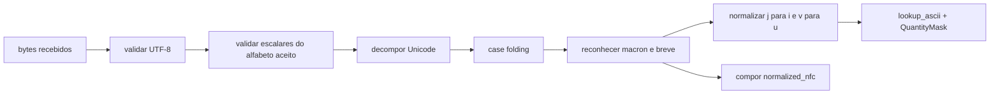

# Plano de Unicode e quantidade vocálica

## Estado

Este documento registra as decisões de arquitetura para a engine C++/WASM. A
camada de entrada C++ já valida UTF-8, aplica a política estrita do alfabeto,
normaliza NFC/NFD, reconhece mácron e breve e mantém a quantidade alinhada às
letras lógicas. O WWDB 1.7 contém a primeira coluna de quantidade flexional e
uma coluna esparsa por lexema/slot de radical. A curadoria inicial cobre as
três regras singulares de primeira declinação terminadas em `a` e 76 alvos
lexicais: seis da família `malum`, 38 do primeiro lote Lewis & Short/Gaffiot e
32 alvos de homógrafos semanticamente diferenciados pela quantidade;
posições ainda não curadas continuam desconhecidas. O
analisador e o exportador Ada permanecem essencialmente ASCII, e o JSON v1
ainda não publica `QuantityMatch`.

As classes, módulos e fluxos que consomem este modelo são detalhados em
[`arquitetura-engine-cpp23.md`](arquitetura-engine-cpp23.md).

O objetivo é permitir que a engine seja construída agora com o banco legado,
no qual a quantidade vocálica é desconhecida, e enriquecida depois por outros
dicionários sem reformar normalização, índices, candidatos morfológicos ou a
ABI.

## Decisões aceitas

1. Uma vogal ASCII sem marca tem quantidade **desconhecida**, não breve.
2. Entrada sem marcas mantém o comportamento e as ambiguidades do WORDS Ada.
3. A entrada é validada e normalizada com `utf8proc` na engine C++.
4. A quantidade possui três estados semânticos: desconhecida, breve ou longa.
5. A chave dos índices permanece em letras-base ASCII normalizadas. Quantidade
   é uma restrição associada à forma, não parte da chave textual.
6. Regras e radicais do banco legado começam com quantidade desconhecida.
7. Novas fontes podem acrescentar quantidade às regras flexionais, aos slots
   lexicais de radical e aos addons sem mudar o algoritmo.
8. O resultado de uma consulta ASCII deve permanecer equivalente ao oráculo
   Ada.

## Semântica dos três estados

Uma codificação conceitual de dois bits por posição é:

```text
00  desconhecida
01  breve
10  longa
11  reservado/inválido
```

Na engine, dois bitsets tornam a comparação mais simples:

```cpp
struct QuantityMask {
    BitSet known;
    BitSet long_vowel;
};
```

| Estado | `known` | `long_vowel` |
| --- | ---: | ---: |
| desconhecida | 0 | 0 |
| breve | 1 | 0 |
| longa | 1 | 1 |

`long_vowel` não pode estar ativo onde `known` esteja desativado. A
representação lógica não fixa a largura do bitset: a seção compacta de finais
pode usar 7 bits, enquanto uma futura representação de radicais pode usar uma
largura maior.

O teste de contradição entre entrada e regra é:

```cpp
conflicts = input.known
          & rule.known
          & (input.long_vowel ^ rule.long_vowel);

compatible = conflicts.none();
```

Assim:

| Entrada | Informação no banco | Decisão |
| --- | --- | --- |
| sem marca | qualquer estado | aceitar |
| longa | longa | aceitar, correspondência exata |
| longa | breve | rejeitar |
| breve | breve | aceitar, correspondência exata |
| breve | longa | rejeitar |
| marcada | desconhecida | aceitar, quantidade ainda não confirmada |

Aceitar uma regra desconhecida é necessário durante o enriquecimento gradual.
Um modo estrito poderá futuramente rejeitá-la, mas não é o comportamento de
compatibilidade inicial.

## Forma normalizada da consulta

A entrada preserva três representações distintas:

```cpp
struct LatinToken {
    std::string original_utf8;
    std::string normalized_nfc;
    std::string lookup_ascii;
    QuantityMask quantity;
};
```

- `original_utf8` preserva exatamente os bytes válidos recebidos;
- `normalized_nfc` é a forma Unicode canônica usada para apresentação;
- `lookup_ascii` contém uma letra-base ASCII por posição lógica;
- `quantity` está alinhada às posições de `lookup_ascii`.

Exemplos:

| Entrada | `normalized_nfc` | `lookup_ascii` | Último `a` |
| --- | --- | --- | --- |
| `rosa` | `rosa` | `rosa` | desconhecido |
| `rosā` | `rosā` | `rosa` | longo |
| `rosa` + U+0304 | `rosā` | `rosa` | longo |
| `ROSĀ` | `rosā` | `rosa` | longo |

NFC e NFD devem ser equivalentes para análise. Índices morfológicos nunca
devem cortar a string UTF-8 por offset de byte; todos os cortes usam posições
de `lookup_ascii` e máscaras alinhadas.

## Pipeline Unicode



A implementação reconhece:

- vogais com mácron precompostas e a sequência base + U+0304;
- vogais com breve precompostas e a sequência base + U+0306;
- variantes maiúsculas por *case folding*;
- `y` como vogal latina, incluindo `ȳ`/`Ȳ` e `y` seguido de mácron ou breve.

A validação dos escalares originais ocorre antes de decomposição e *case
folding*. A lista aceita é deliberadamente estreita: `A-Z`, `a-z`, as vogais
latinas precompostas com mácron/breve e U+0304/U+0306. Assim, caracteres que a
biblioteca poderia dobrar para ASCII, mas que não pertencem ao contrato de
entrada, são rejeitados. Exemplos deliberadamente inválidos são `ß` (`ss`),
`K` (`k`) e `ſ` (`s`). Essa fronteira impede que uma equivalência Unicode
genérica invente uma grafia latina antes da consulta lexical.

Depois de produzir uma letra lógica por posição, a engine compõe a superfície
inteira em uma única chamada NFC e constrói avidamente seus offsets de bytes.
Não se usa uma view UTF-8 com cache `mutable`: o lexer já precisa percorrer toda
a entrada, e os offsets pertencem ao mesmo objeto proprietário que a string.

O normalizador deve diagnosticar, em vez de apagar silenciosamente:

- UTF-8 inválido;
- breve e mácron na mesma letra;
- marcas repetidas ou conflitantes;
- quantidade aplicada a consoante;
- marcas combinantes não suportadas;
- caracteres que não possam ser convertidos para o alfabeto latino aceito.

## Integração com a análise morfológica

O índice continua operando sobre a forma ASCII. Quantidade é aplicada depois
do encontro textual e antes de aceitar o candidato:

```text
LatinToken
  -> EndingTrie(lookup_ascii)
  -> regra flexional com a mesma terminação-base
  -> comparar quantidade da terminação
  -> produzir candidato de radical
  -> StemIndex(radical-base)
  -> comparar quantidade do radical, quando conhecida
  -> compatibilidade morfológica existente
```

Para a primeira declinação, depois que as regras forem curadas:

```text
entrada: rosā
base:    rosa
marca:      L

EndingTrie("a")
  NOM S  a breve -> conflito
  VOC S  a breve -> conflito
  ABL S  a longa -> aceita
```

Para `rosa`, a máscara da entrada é desconhecida e todas as análises legadas
continuam disponíveis.

A remoção de uma terminação, de um prefixo ou de um sufixo deve produzir uma
*view* da base e a fatia correspondente da máscara. Nenhuma etapa deve
reconstruir ou indexar a string UTF-8 original.

## Interfaces da engine

A engine depende de views lógicas, não da codificação física do WWDB:

```cpp
struct InflectionRuleView {
    EndingId ending_id;
    QuantityMaskView quantity;
    PartOfSpeech part_of_speech;
    Paradigm paradigm;
    Morphology morphology;
    StemKey stem_key;
};

struct LexicalStemView {
    StemStringId text_id;
    QuantityMaskView quantity;
};

class DatabaseView {
public:
    Range match_endings(std::string_view word) const;
    Range lookup_stem(std::string_view stem) const;
    Range match_suffixes(std::string_view stem) const;

    InflectionRuleView inflection(RuleId id) const;
    LexicalStemView lexical_stem(LexemeId id, StemKey key) const;
};
```

O leitor retorna máscaras inteiramente desconhecidas quando as seções de
quantidade não existem. Dessa forma, o mesmo binário aceita WWDB 1.6 ou 1.7;
em 1.7 ambas as seções são obrigatórias e estruturalmente validadas.

## Modelo do banco futuro

### Regras flexionais

Uma terminação possui no máximo sete letras no formato atual. Duas máscaras de
7 bits cabem em um `u16`:

```text
bits 0..6    known_mask
bits 7..13   long_mask
bits 14..15  reservados, sempre zero
```

Para 1.785 regras, a coluna inteira custa no máximo:

```text
1.785 × 2 = 3.570 bytes RAW
```

No WWDB 1.7 ela é a seção `inflection_quantities`, indexada diretamente por
`rule_id`: `count == número de regras`, `stride == 2` e acesso O(1). A coluna
inteira ocupa 3.570 bytes; registros ainda não curados são zero. Ao ler WWDB
1.6, ausência da seção equivale a todas as máscaras zero.

A quantidade pertence à regra completa, não à string deduplicada da
terminação. O mesmo texto `a` pode representar nominativo breve ou ablativo
longo.

### Radicais lexicais

Quantidade lexical não pode pertencer somente ao `StemStringPool`. Dois
lexemas podem compartilhar a mesma base ASCII e possuir quantidades diferentes:

```text
StemStringPool: "mal"

Lexeme A, slot 1 -> stem_id="mal", quantidade breve
Lexeme B, slot 1 -> stem_id="mal", quantidade longa
```

Portanto, a quantidade acompanha o slot de radical do lexema. O WWDB 1.7 usa
uma seção esparsa ordenada com registros de nove bytes:

```text
u24 key        bits 0..15 lexeme_id, 16..17 lexical_slot
u24 known      até 18 posições lógicas
u24 long       até 18 posições lógicas
```

O leitor faz `lower_bound` pela chave; o custo em disco é proporcional apenas
aos slots curados. Máscaras longas fora de `known`, bits além do texto, chaves
duplicadas e marcas sobre consoantes invalidam o banco.

### Caso-guia: `malum`

Lewis & Short distingue `mālum` “maçã”, `mālus` “macieira”, `mālus` “mastro”,
`mălum` “mal” e `mălus` “mau”. Todos compartilham a chave ASCII `mal`.
Os microdados iniciais associam o bit do `a` ao lexema/slot, não à string
deduplicada:

```text
mālum -> maçã, macieira, mastro e a leitura flexional de māla
mălum -> mal/desgraça e o adjetivo mălus
malum -> união legada das duas famílias
```

Assim a quantidade restringe homógrafos sem duplicar o índice e sem uma
exceção `if (word == "malum")` no código.

A conferência foi feita nos dicionários somente-leitura em
`/mnt/projects/Projects/Dicionarios` e `/mnt/projects/Projects/textllm`. O lote
promovido usa os IDs `ls_dict` de Lewis & Short tanto para a família longa como
para a breve. O Faria v3 quality é o candidato Faria mais recente e resulta de
OCR revisado por LLM, mas seus três headwords `malum` atuais não conservam as
marcas. Duas observações marcadas da migração `retificado_v2` ficam como
`probable`, sem poder alterar o WWDB sozinhas.

O `superdb.sqlite` é útil para localizar oito fontes, porém o próprio projeto
de dicionários o classifica como protótipo derivado, não canônico, e sua tabela
de equivalências está vazia. `dicionarios_unificados.sqlite` é mais antigo e
agrega apenas Cardoso, Fonseca e Velez. Portanto, a proveniência registra a
fonte subjacente e seu `source_entry_id`, nunca “SuperDB” como autoridade.

### Importação rastreável

`QUANTITY_EVIDENCE.jsonl` contém dois tipos de registro:

- `source`: obra, artefato, versão, método e classe de confiabilidade;
- `evidence`: alvo WWDB, forma-base ASCII, forma marcada, locator, testemunho,
  confiança e rótulo humano.

`import_quantities.py` normaliza cada forma em NFD e deriva as máscaras; elas
não são digitadas manualmente. Ele rejeita letras-base divergentes, marcas em
consoantes, marcas múltiplas, fontes inexistentes e conflitos entre evidências
confirmadas. A política é conservadora:

| Fonte/observação | Resultado |
| --- | --- |
| fonte estabelecida ou revisada + `confirmed` | promover e combinar bits |
| qualquer fonte + `probable`/`needs_review` | reter somente no relatório |
| fonte auxiliar + `confirmed` | erro de política |
| duas confirmações contraditórias | erro fatal |

O relatório JSON é uma saída de auditoria sob demanda. O runtime continua
recebendo apenas as máscaras consolidadas, sem strings de proveniência, para
não aumentar memória nem latência de lookup.
As classes de confiabilidade são técnicas/editoriais e não substituem o
manifesto de direitos e redistribuição de cada obra.

### Descoberta assistida, sem promoção automática

`poc/compact-db/suggest_quantity_evidence.py` transforma o SuperDB somente em
índice de descoberta. A autoridade continua sendo `ls_dict` ou `gaffiot`,
identificada pelo locator original. O casamento é propositalmente menor que um
lemmatizador geral:

1. lê `DICTFILE.GEN` em registros fixos de 180 bytes, preservando
   `dictionary_entry` e o `slot` reais;
2. extrai a primeira forma de citação marcada e aceita apenas bases ASCII após
   decomposição Unicode;
3. considera apenas o radical de citação Whitaker (`slot 1`), uma terminação
   curta compatível com a classe e quantidade que caia dentro do radical;
4. usa POS e gênero quando disponíveis; sobreposição de glossas fica exposta
   como sinal de revisão, nunca como confirmação;
5. emite somente `needs_review` e pode omitir pares fonte/alvo já presentes no
   manifesto.

No snapshot local, o filtro inicial de prefixo puro geraria 221.692 pares e
foi rejeitado como ruidoso. Depois das revisões e da promoção explícita de 76
alvos, a fila conservadora contém 16.780 candidatos ainda não registrados:
16.460 de Lewis & Short e 320 de Gaffiot. Há 13.646 candidatos com alvo único,
1.381 testemunhos ambíguos e 127 alvos com conflito real de quantidade.

A prioridade nova exige a mesma palavra de citação após remover as marcas e
uma oposição explícita longa × breve na mesma posição. Restam 39 grupos desse
tipo, com 157 mapeamentos candidatos; somente oito grupos têm mapeamentos
estruturalmente diretos. O score continua incapaz de confirmar paradigma ou
sentido. Essas contagens são diagnóstico do snapshot, não conteúdo do WWDB. A
metodologia, rejeições e faixas editoriais estão em
[`revisao-fila-quantidades.md`](revisao-fila-quantidades.md).

### Addons

Prefixos, sufixos e outras transformações devem usar o mesmo modelo
base ASCII + quantidade opcional. Isso não torna a aplicação de sufixos
recursiva: a política de profundidade continua pertencendo ao algoritmo da
engine.

## Fast lookup e alta densidade

Os índices continuam compartilhando uma única chave textual:

```text
EndingTrie("a")        -> Range<RuleId>
StemIndex("mal")       -> Range<StemReference>
AddonSuffixTrie("icul") -> Range<AddonId>
```

Somente depois do encontro são consultadas as colunas de quantidade. Não é
necessário duplicar chaves `a`, `ā` e `ă`, nem manter tries UTF-8 paralelas.

A representação da engine e a representação de disco são deliberadamente
separadas. A engine pode usar bitsets convenientes; o WWDB pode usar colunas
compactas e esparsas. Contagens, offsets e larguras concretas não devem ser
hardcoded no algoritmo.

## Resultado e JSON

O contrato JSON v1 e o exportador Ada atuais permanecem como oráculo ASCII.
Antes de expor a nova funcionalidade, o schema deverá ser evoluído ou revisado
explicitamente. A intenção semântica é:

```json
{
  "query": {
    "text": "rosā",
    "normalized": "rosā",
    "mode": "latin"
  },
  "form": {
    "stem": "ros",
    "stemKey": 1,
    "ending": "ā"
  },
  "morphology": {
    "declension": 1,
    "variant": 1,
    "case": "ablative",
    "number": "singular",
    "gender": "feminine"
  }
}
```

- `query.text` preserva a entrada válida como recebida;
- `query.normalized` usa NFC;
- `form.ending` apresenta a terminação observada normalizada;
- a chave ASCII de lookup é um detalhe interno;
- comprimentos são definidos em letras-base, não bytes UTF-8.

A estrutura interna de resultado deve conservar o intervalo da forma de
superfície e o `rule_id`. Assim o serializador pode apresentar `ā` enquanto a
regra continua apontando para a chave-base `a`.

## Evidência de quantidade

Além de compatível/incompatível, a engine pode registrar internamente:

```cpp
enum class QuantityMatch {
    unspecified, // consulta sem marcas
    exact,       // todas as marcas foram confirmadas
    unknown      // consulta marcada, banco ainda sem informação
};
```

Isso permite priorizar correspondências confirmadas em consultas marcadas sem
mudar a ordenação das consultas ASCII. A exposição desse campo no JSON fica
adiada até o contrato Unicode ser definido.

## Compatibilidade e testes

A propriedade central é:

```text
se input.quantity.known estiver vazio:
    resultados da engine nova = resultados do Ada
```

Cobertura implementada:

1. corpus ASCII comparado ao executável Ada, incluindo ordem e multiplicidade;
2. equivalência entre NFC e NFD;
3. equivalência de caixa, incluindo vogais macronizadas maiúsculas;
4. `rosa` preservando as análises legadas;
5. entrada marcada contra regra desconhecida;
6. UTF-8 inválido, marcas conflitantes e quantidade sobre consoante;
7. rejeição, antes do *case folding*, de caracteres fora do alfabeto aceito;
8. limites lógicos para uma vogal cuja sequência NFC ainda use mais de um
   *code point*;
9. macrons preservados por reescritas e derivações existentes;
10. `rosā` confirmando o ablativo singular e `rosă` confirmando
    nominativo/vocativo da primeira declinação;
11. `mālum` e `mălum` particionando os homógrafos lexicais curados;
12. consulta ASCII mantendo a união e a ordem legadas;
13. correspondências exatas ordenadas antes das regras com quantidade ainda
    desconhecida.

Permanecem pendentes para os próximos lotes de curadoria:

1. ampliar as máscaras flexionais além das três regras iniciais de `-a`;
2. revisar por lotes os candidatos de Lewis & Short/Gaffiot e alimentar o
   importador apenas com locators confirmados; melhorar os metadados
   gramaticais migrados do Gaffiot antes de buscar maior cobertura;
3. quantidade nos addons e nas formas de `UNIQUES.LAT`;
4. decidir se `QuantityMatch` será exposto em uma revisão do JSON.

## Papel de `LatinaeTabulae.ods`

`LatinaeTabulae.ods` contém paradigmas pedagógicos úteis para orientar a
curadoria e gerar casos de teste. Ela não substitui `INFLECTS.LAT`, pois não
registra sistematicamente chave de radical, variante, classe completa, época,
frequência, ordem e irregularidades.

Ela deve ser tratada como referência e possível fonte auxiliar de testes, não
como fonte normativa única do runtime.

## Divisão entre código e dados

Permanece válida a regra:

```text
código = normalizar, segmentar, comparar e ordenar
dados  = evidências em QUANTITY_EVIDENCE.jsonl -> máscaras em QUANTITIES.LAT/WWDB
```

O suporte aos três estados, a comparação e a política de desconhecido ficam na
engine. As máscaras concretas ficam no WWDB. Embutir um WWDB gerado no módulo
WASM seria apenas uma decisão de empacotamento, não transformaria os dados
linguísticos em lógica hardcoded.
