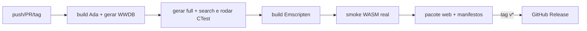

# Política do repositório e releases

Data do corte: 2026-08-29.

O diretório `whitakers-words/` faz parte deste repositório. Ele contém a fonte
Ada usada como oráculo, os dados canônicos legados, os testes históricos e o
pipeline do WWDB; não deve ser tratado como uma árvore temporária importada.

## O que fica no Git

- código C++23, Ada, JavaScript, Python e CMake;
- schemas, testes, corpus e documentação;
- `DICTLINE.GEN`: apesar do nome, é a entrada lexical humana da qual os outros
  `.GEN` são derivados;
- `INFLECTS.LAT`, `ADDONS.LAT`, `UNIQUES.LAT` e os demais dados legados de
  entrada;
- `REWRITES.LAT`, `QUANTITIES.LAT` e `QUANTITY_EVIDENCE.jsonl`;
- decisões editoriais futuras e a planilha `LatinaeTabulae.ods` enquanto ela
  for uma fonte controlada do projeto;
- fontes do packer e do pipeline de auditoria/revisão.

## O que é regenerável

O [`.gitignore`](../../.gitignore) raiz exclui builds CMake, staging de
distribuição, caches Python, cobertura e metadados do host.

O [`.gitignore`](../.gitignore) do Words Ada exclui:

- `bin/`, `lib/`, `obj/` e a configuração Ada gerada;
- `DICTFILE.GEN`, `STEMFILE.GEN`, `STEMLIST.GEN`, `INFLECTS.SEC` e outros
  índices derivados;
- `__pycache__`, `.pyc`, `.DS_Store` e capturas locais;
- todo `poc/compact-db/output/`, exceto `.gitkeep`.

Os snapshots WWDB, representações comprimidas, hashes e pacotes ZIP saem do
Git porque são produtos determinísticos e grandes. O CI os reconstrói das
fontes versionadas e publica somente os artefatos validados.

## Full e search

Os nomes de distribuição descrevem capacidade, não layout:

| Arquivo | Conteúdo | Estado |
| --- | --- | --- |
| `words-full.wwdb` | morfologia, metadados e significados | implementado; layout `dense` PoC 1.8 |
| `words-search.wwdb` | morfologia e IDs, sem definições | implementado; layout `search-only` PoC 1.8 |

No CLI, o banco full produz os JSONs `analysis-v1` e `search-v1`; o banco
search produz somente `search-v1`. No navegador, ambos expõem a projeção
tipada Embind v2, mas somente o full admite `analyze()` e inclui `meaning`.
Uma tentativa de análise completa no search falha explicitamente. Ambos usam
o mesmo `datasetId`, calculado
sobre o manifesto canônico de fontes e atribuição de IDs. Cada projeção tem
também seu próprio hash físico para integridade e cache.

Essa distinção evita chamar a base publicada de “dense”, que é só uma escolha
de layout, e evita chamar o companion sem significado de “full”.

## CI e release por tag

O workflow [`.github/workflows/build.yml`](../../.github/workflows/build.yml)
segue o padrão útil do projeto `indexador`, reduzido ao escopo desta engine:

Em toda mudança, o job nativo reconstrói o oráculo Ada e os dados gerados,
cria os WWDB `dense` e `search-only` e executa testes unitários, diferenciais, corpus e
pipelines. O job WebAssembly recebe exatamente esse snapshot validado, gera os
assets, executa o smoke test real e publica um artifact de CI.

Os builds Ada/GPRBuild, C++ nativo e WebAssembly usam `-j"$(nproc)"` no
runner. O Makefile Ada permanece serial na orquestração dos geradores por
dependência, mas cada chamada ao `gprbuild` recebe o mesmo número de CPUs.

Uma tag `v*` acrescenta `words-web-VERSAO.tar.gz` e um manifesto SHA-256 a uma
GitHub Release. O pacote contém:

- `words-engine.mjs`, `words-engine.d.mts` e `words-engine.d.ts`, a API de
  aplicação;
- `words_wasm.mjs`, `words_wasm.wasm` e `words_wasm.d.ts`, a camada gerada;
- `words-full.wwdb` e `words-search.wwdb`;
- `dataset-manifest.json` e `manifest.json`;
- variantes `.br`/`.gz` de todos esses assets, geradas deterministicamente
  pelo exportador com os codecs nativos do Node.

A mesma release também anexa cada banco separadamente, sem exigir o pacote
completo:

- `words-full-VERSAO.wwdb`, `.wwdb.br` e `.wwdb.gz`;
- `words-search-VERSAO.wwdb`, `.wwdb.br` e `.wwdb.gz`;
- `dataset-manifest-VERSAO.json` e `words-web-manifest-VERSAO.json`;
- `words-assets-VERSAO.sha256`, cobrindo os bancos, manifestos e pacote.

A tag faz parte do nome para permitir URLs e caches explícitos. A GitHub
Release já fornece o escopo imutável da versão; `datasetId` identifica o
conteúdo lógico compartilhado por full e search, enquanto os SHA-256 do
manifesto identificam cada representação física.

[`scripts/export-wasm-assets.mjs`](../../scripts/export-wasm-assets.mjs)
calcula hashes e o `datasetId` sem timestamps nem caminhos absolutos no
manifesto. O pacote tar também fixa ordem, proprietário e timestamp para
reduzir variação entre builds equivalentes.
O manifesto inclui `LEXEMES.LAT` quando a projeção editorial está presente,
de modo que full e search enriquecidos compartilhem uma identidade nova e não
colidam com o banco legado.
