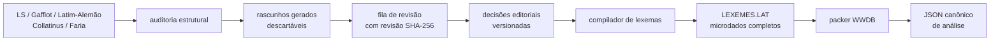

# Revisão editorial de novos lexemas

Data do corte: 2026-08-29.

Este documento define a passagem dos rascunhos estruturais produzidos pela
auditoria lexical para uma futura extensão do banco do Words. O princípio
central é que estrutura morfológica corroborada não decide identidade de
sentido nem autoriza copiar uma definição para o runtime.

O gerador implementado neste corte é
[`../poc/compact-db/prepare_lexeme_review.py`](../poc/compact-db/prepare_lexeme_review.py).
Ele só transforma JSONL local, não altera os dicionários, `DICTFILE.GEN` ou o
WWDB e não promove registros automaticamente.

O ledger é verificado por
[`../poc/compact-db/validate_lexeme_decisions.py`](../poc/compact-db/validate_lexeme_decisions.py).
Esse programa também é somente leitura em relação às fontes: escreve apenas o
relatório solicitado e nunca gera `LEXEMES.LAT` ou modifica o WWDB.

A projeção executável é feita separadamente por
[`../poc/compact-db/compile_lexemes.py`](../poc/compact-db/compile_lexemes.py).
Ela repete a validação completa e só então grava `LEXEMES.LAT`; o packer trata
esse arquivo como entrada opcional. Assim, validar uma hipótese editorial não
equivale a publicá-la.

## Separação das camadas



O JSON canônico de análise é uma resposta da engine sobre um lexema já
persistido. Testemunhas, licenças, notas e estados de revisão são dados de
build e não entram em `analysis-v1` ou no perfil `search-only`.

Há três contratos editoriais distintos:

1. `whitakers-words.lexeme-structural-draft.v1`: saída reproduzível e
   descartável da auditoria;
2. `whitakers-words.lexeme-review-candidate.v1`: fila reproduzível com chave
   estável, revisão do conteúdo, evidência por fonte e triagem;
3. `whitakers-words.lexeme-editorial-decision.v1`: decisão humana que fixa
   `draft_id + revision` e pode autorizar o compilador.

Os schemas da fila e da decisão são, respectivamente,
[`../../schemas/lexeme-review-candidate-v1.schema.json`](../../schemas/lexeme-review-candidate-v1.schema.json)
e
[`../../schemas/lexeme-editorial-decision-v1.schema.json`](../../schemas/lexeme-editorial-decision-v1.schema.json).

## Política por fonte e por campo

Independência não é uma propriedade global da obra. Uma fonte pode ser forte
para paradigma e apenas auxiliar para redação semântica.

| Fonte | Identidade/sentido | Morfologia | Quantidade | Uso editorial |
| --- | --- | --- | --- | --- |
| Lewis & Short | independente; principal segmentador inglês | auxiliar | independente | texto requer atribuição e revisão de licença local |
| Gaffiot | independente; corroborador francês | POS migrado pode ser inferido | independente | XML bruto preferível à tabela de sentidos incompleta; material CC0 |
| Latim–Alemão | corroborador semântico curto | independente e forte para paradigma/formas | independente quando marcada | redação GPL não vira definição canônica automaticamente |
| Collatinus | derivado de outras obras | forte para modelos e radicais | derivado | gloss é apenas semente editorial; nunca segundo voto |
| Faria v3 | independente, em português | confirmação auxiliar | independente | OCR revisado por LLM; preservar status, proveniência e declaração de direitos |

Não se calcula “maioria de strings” entre inglês, francês, alemão e português.
Cada afirmação aprovada deve registrar no ledger a evidência por campo. O WWDB
receberá apenas a redação curta revisada; textos longos, localizadores e a
trilha de licença continuam fora do runtime.

## O que os 66 rascunhos realmente representam

O corte de núcleo possui 65 estruturas confirmadas por formas do léxico
Latim–Alemão. Somente `fidele` permanece com estrutura empírica sem essa
validação. Todos têm pelo menos duas famílias independentes; 12 têm três e 54
têm duas. Não foi encontrado conflito inequívoco de sentido nuclear entre as
fontes, mas há polissemia, substantivações, variantes e remissões que impedem
aprovação automática.

Ao consultar a engine Ada individualmente:

| Resultado atual | Candidatos | Interpretação |
| --- | ---: | --- |
| `UNKNOWN` | 29 | provável ganho direto de cobertura |
| caminho artificial | 29 | entrada explícita enriquece sentido e evita derivação genérica |
| retorno direto | 7 | exige distinguir duplicata, outro POS, homógrafo ou falso reparo |
| `Two_Words` | 1 | `satagius` é dividido falsamente como `satag + ius` |

Nos sete retornos diretos:

- `decimus` já está representado como ordinal do paradigma de `decem`;
- `summus` já existe como superlativo irregular;
- `fidele` é advérbio, enquanto a resposta existente vem de `fidelis`;
- `furens` precisa separar particípio e adjetivo lexicalizado;
- `inferius` “sacrificial” é distinto do comparativo neutro de `inferus`;
- `serarius` recebe um reparo falso `se → ce` e encontra `cerarius`;
- `vestiarius` precisa reconciliar adjetivo e uso substantivado existente.

`sestertiarius`, embora classificado como artificial, também expõe uma análise
semanticamente falsa (`ses + tertiarius`). A regra de precedência futura deve
ser entrada lexical exata, depois os fallbacks `Two_Words`, ortográficos e
artificiais. Isso não elimina os fallbacks para consultas realmente
desconhecidas.

A fila também aceita opcionalmente um JSONL `analysis-v1` por
`--analysis-input`. Nesse caso ela registra a cobertura da implementação
medida, os lexemas encontrados e um `baseline_revision` separado. Esse dado é
triagem, não voto semântico. No snapshot nativo atual, com `Two_Words` legado
explicitamente habilitado, a classificação reproduzível é:

| Cobertura nativa | Registros |
| --- | ---: |
| derivação artificial | 29 |
| análise regular direta | 6 |
| reparo ortográfico | 1 |
| desconhecido sem sugestão | 23 |
| desconhecido com sugestão de dois termos | 7 |

Os últimos dois grupos somam os 30 sem análise. A diferença em relação à
apresentação textual Ada — que destaca somente `satagius` como `Two_Words` — é
mantida explícita: não se deve chamar a sugestão nativa de cobertura lexical,
nem confundir o falso reparo de `serarius` com análise direta.

A triagem conservadora do conjunto é:

- mesclar, sem criar novo lexema: `decimus`, `summus`;
- manter em espera estrutural: `fidele`;
- revisar identidade ou reclassificação: `oleagineus`, `vestiarius`, `furens`,
  `galbaneus`, `scirpeus`;
- 58 restantes podem virar propostas canônicas revisáveis, nunca importações
  automáticas.

## Quantidade vocálica na fila

Cada vogal do lema recebe um estado independente. Ausência de marca continua
`unknown`; ela nunca é interpretada como breve. Uma marca só vira `consensus`
com duas famílias independentes concordantes. Maioria numérica não resolve
oposição entre famílias.

No núcleo há seis candidatos com evidência conflitante:

| Lema | Índice ASCII, zero-based | Evidência |
| --- | ---: | --- |
| `draconteus` | 7 | breve em LS; longa em Gaffiot |
| `durateus` | 3 | breve em LS; longa em Gaffiot |
| `expositicius` | 7 | longa em Gaffiot/Latim–Alemão; breve em LS |
| `fidele` | 5 | breve em Gaffiot; longa em LS |
| `lanisticius` | 6 | longa em LS; breve apenas no Collatinus derivado |
| `stramenticius` | 8 | breve em LS; longa no Latim–Alemão |

Os cinco primeiros conflitos entre autoridades independentes são destacados
como tais. `lanisticius` tem a flag separada
`derived_quantity_disagreement`: uma única autoridade independente não é
suficiente para superar o testemunho derivado, portanto a posição também fica
desconhecida. Com o Faria, aparecem mais seis divergências a revisar:
`herbeus`, `imperpetuus`, `oculeus`, `praesentaneus`, `russeus` e `scirpeus`.

O relatório reproduzido do núcleo ficou assim:

| Estado de quantidade do lema | Registros |
| --- | ---: |
| conflito em alguma posição | 6 |
| consenso parcial, sem conflito | 45 |
| somente uma fonte independente | 14 |
| apenas fonte derivada | 1 |

Nenhum dos 66 recebe promoção automática. Quantidade conflitante não precisa
bloquear o lexema inteiro: após decisão semântica, a vogal pode permanecer
indefinida no banco.

## Contrato da decisão humana

`draft_id` identifica a chave `(lema ASCII, POS, próprio/comum)`. `revision` é
o SHA-256 do rascunho completo; qualquer mudança de evidência ou estrutura
torna a decisão anterior obsoleta. Uma decisão trata um ou mais `sense_ids` e
usa uma disposição fechada:

- `accept_new`: gera uma entrada nova quando o ledger é compilado;
- `merge_existing`: liga o sentido a uma entrada Words existente;
- `variant_of`: registra relação explícita com uma entrada existente;
- `reject`: documenta um falso candidato;
- `defer`: mantém o caso aberto.

Somente `accept_new` pode conter o bloco canônico. `merge_existing` e
`variant_of` exigem `dictionary + entry_id`. Mais de uma decisão pode apontar
para o mesmo rascunho para separar homógrafos, desde que seus sentidos aceitos
sejam disjuntos.

Invariantes do compilador:

- não aceitar uma decisão cuja revisão não corresponda à fila atual;
- exigir significado curto próprio e proveniência por campo;
- validar NFC e garantir que remover mácron/breve produza a base ASCII;
- manter radical ASCII minúsculo com até 18 letras e slots únicos em `1..4`;
- tratar colisão estrutural com o Words ou outra decisão como erro explícito;
- não copiar glossas externas diretamente para o arquivo compacto;
- resolver IDs editoriais para `entry_id` somente durante a compilação.

O validador implementado já torna executáveis as invariantes anteriores à
compilação:

- valida fila e ledger pelos schemas Draft 2020-12;
- exige que todo `draft_id` exista e que a `revision` seja exatamente a atual;
- rejeita `decision_id` duplicado e duas decisões correntes para o mesmo
  `(draft_id, sense_id)`;
- em `accept_new`, exige POS, paradigma e radicais idênticos à estrutura
  revisada, forma de dicionário e significado em NFC e proveniência conhecida
  para forma, significado e propriedades;
- resolve `quantity_evidence_ids` contra o manifesto quando houver referências;
- em `merge_existing`, confere o alvo contra o baseline fixado, caso a fila
  possua um;
- rejeita duas decisões `accept_new` com a mesma assinatura estrutural.

Uma fila parcialmente revisada é válida. O relatório distingue `decided` de
`resolved`: `defer` conta como decisão, mas continua pendente; ausência de
decisão é registrada em `unreviewed_candidates`, não como erro. O processo sai
com código zero quando todas as decisões presentes são válidas e com código um
quando encontra qualquer violação.

## Limite do formato denso

O packer atual grava contagens e offsets de referências de radical em `u16`.
O banco já usa 62.086 dessas referências, deixando 3.449 posições. Os 66 ou
80 rascunhos deste corte cabem, mas a fila de 3.211 candidatos provavelmente
não cabe. Antes de ampliação em massa, essa seção precisa migrar para `u32` ou
ser dividida em uma extensão própria. A contagem de lexemas também usa limite
de 65.536, mas ainda não é o gargalo imediato.

O corte implementado conserva esse limite e falha explicitamente antes de
escrever qualquer WWDB que exceda a capacidade. A análise de quais IDs são
implícitos, quais precisam permanecer e quais seções podem usar delta está em
[`compressao-ids-e-ordem.md`](compressao-ids-e-ordem.md).

## Reprodução

Depois de gerar `lexeme-structural-drafts.jsonl` conforme a auditoria:

```bash
python3 poc/compact-db/prepare_lexeme_review.py \
  /tmp/lexeme-structural-drafts.jsonl \
  --output /tmp/lexeme-review.jsonl \
  --report /tmp/lexeme-review-report.json
```

Opcionalmente, na raiz do repositório, a situação da engine nativa pode ser
capturada sem iniciar um processo por palavra:

```bash
jq -r .ascii_lemma /tmp/lexeme-structural-drafts.jsonl | \
  ./build/words_cli \
    --database whitakers-words/poc/compact-db/output/words-poc-dense.wwdb \
    --dataset-id sha256:0000000000000000000000000000000000000000000000000000000000000000 \
    --format analysis --two-words=legacy --batch-json-lines \
    > /tmp/lexeme-engine-analysis.jsonl

python3 whitakers-words/poc/compact-db/prepare_lexeme_review.py \
  /tmp/lexeme-structural-drafts.jsonl \
  --analysis-input /tmp/lexeme-engine-analysis.jsonl \
  --output /tmp/lexeme-review.jsonl \
  --report /tmp/lexeme-review-report.json
```

O ledger pode então ser validado sem compilar dados:

```bash
python3 whitakers-words/poc/compact-db/validate_lexeme_decisions.py \
  /tmp/lexeme-review.jsonl \
  LEXEME_DECISIONS.jsonl \
  --quantity-evidence whitakers-words/QUANTITY_EVIDENCE.jsonl \
  --report /tmp/lexeme-decision-validation-report.json
```

`--quantity-evidence` pode ser omitido apenas quando nenhuma decisão referencia
`quantity_evidence_ids`.

Depois da revisão humana, a mesma fila e o ledger são compilados para a entrada
estreita do packer:

```bash
python3 whitakers-words/poc/compact-db/compile_lexemes.py \
  /tmp/lexeme-review.jsonl \
  LEXEME_DECISIONS.jsonl \
  --quantity-evidence whitakers-words/QUANTITY_EVIDENCE.jsonl \
  --output whitakers-words/LEXEMES.LAT \
  --report /tmp/lexeme-compilation-report.json
```

`LEXEMES.LAT` usa JSONL numérico
`whitakers-words.compiled-lexeme.v1`: quatro slots ASCII, meaning curto, POS,
paradigma, payload de classe e metadados já compactáveis. A ordenação canônica
independe da ordem do ledger. O arquivo é derivado e ignorado pelo Git; o
ledger humano permanece a fonte versionada.

Neste corte, `quantity_evidence_ids` conserva e valida a trilha editorial, mas
não é convertido automaticamente em máscaras por slot. Todo radical importado
entra com quantidade `unknown`, preservando o comportamento ASCII legado.
Antes de publicar dois lexemas cuja distinção dependa somente de longa × breve,
o microformato precisa receber `known_mask`/`long_mask` por slot e o compilador
deve resolver consenso confirmado para essas máscaras. Não se infere breve de
uma vogal sem marca.

Ao gerar os perfis full e search, o packer acrescenta exatamente os mesmos
lexemas na mesma ordem e, portanto, preserva o espaço de IDs entre as duas
projeções. Sem `LEXEMES.LAT`, a saída continua byte a byte igual à base
legada. Colisão estrutural com uma entrada existente, perda de propriedade,
radical inválido, meaning acima de 255 bytes ou overflow `u16` são erros.

Para o snapshot deste corte, a saída contém 66 candidatos, todos com
`decision.status = needs_review` e
`automatic_promotion_allowed = false`. Os arquivos em `/tmp` são artefatos de
reprodução; somente decisões humanas futuras devem ser versionadas.
