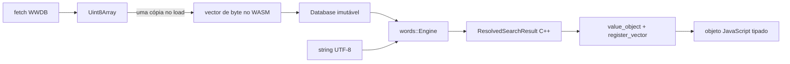

# Engine de análise no navegador

Data do corte: 2026-08-30.

A mesma `words::Engine` C++23 usada pelo CLI está disponível no navegador por
uma fronteira Embind pequena. A camada WebAssembly não reimplementa lexer,
morfologia ou quantidade vocálica: ela carrega um snapshot WWDB e projeta a IR
em `struct`s registradas no Embind. JSON é backend de apresentação exclusivo
do CLI e dos testes de aceitação nativos; `nlohmann_json` não participa do
grafo de build WebAssembly.

## Fluxo e ownership



O único bloco binário da API é o dataset serializado. O JavaScript entrega um
`Uint8Array`; o C++ aloca o `std::vector<std::byte>` e usa uma
`typed_memory_view` temporária para copiá-lo. Depois do `load`, o `Database`
mantém ownership dessa imagem e os seus `std::span`/`std::string_view`
continuam válidos durante toda a vida da engine.

Não são publicados `_malloc`, `_free`, `HEAPU8`, `ccall` ou `cwrap`. O
allocator e a memória linear continuam existindo internamente no módulo, mas
o host não administra ponteiros. Isso elimina pares públicos `pointer +
length` e a possibilidade de consulta depois de `free`.

Resultados também não trafegam por ponteiro nem por texto JSON. `SearchQuery`,
`ResolvedSearchHit`, `SearchMorphology`, flags lexicais, diagnósticos e
sugestões são `value_object`; vetores têm registro explícito no Embind. A
wrapper copia esses vetores para arrays JavaScript e libera imediatamente cada
handle Embind.

O carregamento nativo é transacional: um candidato só substitui a base ativa
depois de `Engine::create` validar a imagem completa. Uma tentativa de reload
inválida não descarta o snapshot anterior.

## API de alto nível

[`wasmsrc/words-engine.mjs`](../../wasmsrc/words-engine.mjs) expõe
`createWordsAnalysisEngine`. Ela carrega o módulo, busca ou recebe o banco,
verifica o resultado do loader e converte somente containers Embind em arrays
JavaScript; não chama `JSON.parse`.

```javascript
import {createWordsAnalysisEngine} from "./words-engine.mjs";

const release = await fetch("./manifest.json").then((response) => response.json());
const engine = await createWordsAnalysisEngine({
  databaseUrl: release.databases.full.file,
  datasetId: release.datasetId,
});

const complete = engine.analyze("mālum");
const compact = engine.search("anaticulus");
const love = engine.search("amamus");
console.log(love.hits[0].lemma);             // "amo"
console.log(love.hits[0].morphology.tense);  // "present"
console.log(love.hits[0].morphology.person); // 1
const suggestion = engine.analyze("texto", {twoWords: true});

engine.dispose();
```

Para uma interface que só precisa de resultados enxutos, basta trocar o
arquivo selecionado no manifesto:

```javascript
const searchEngine = await createWordsAnalysisEngine({
  databaseUrl: release.databases.search.file,
  datasetId: release.datasetId,
});
console.log(searchEngine.databaseKind); // "search"
const compactOnly = searchEngine.search("cuique");
```

`analyze` e `search` devolvem, respectivamente, os contratos
`whitakers-words.browser-analysis` e `whitakers-words.browser-search`, versão
3. Hits são uma união discriminada por `kind`: `lexical`, `compound` ou
`artificial`. Cada leitura contém a forma resolvida (`stem`, `ending`,
`recognized`) e passos semânticos ordenados de addon e reescrita. Um passo
indica seu `target` (`form`, `source` ou `auxiliary`) e resolve IDs para tipo e
texto; por exemplo, `studiisque` expõe `studiis` e o tackon `que`.
`analyze` acrescenta `meaning` e exige o banco full; `search` nunca acessa nem
devolve definições e funciona com os dois perfis. O segundo argumento
`{twoWords: true}` habilita somente a sugestão legada opt-in. Consultas de dois
tokens pertencentes à gramática fechada de compostos continuam sendo
reconhecidas normalmente pelo núcleo.

`databaseKind` informa `"full"` ou `"search"`. `analyze()` exige o banco
full e falha antes de consultar o núcleo quando a projeção search está ativa;
`search()` funciona nas duas projeções com o mesmo contrato e espaço de IDs.
Presença de lexema, regra e significado usa booleano explícito no C++; a
wrapper converte IDs ausentes para `null`, sem reservar sentinelas.

`dispose()` é idempotente e deve ser chamado quando a aplicação não precisar
mais do snapshot. A wrapper bloqueia consultas depois do descarte. Erros
linguísticos, inclusive UTF-8 ou caractere não suportado, continuam sendo
resultados estruturados. Configuração inválida, download malsucedido e WWDB
corrompido rejeitam a criação da engine.

Também é possível passar `databaseBytes: Uint8Array|ArrayBuffer`, útil para
cache próprio, Service Worker ou teste. `moduleFactory`, `moduleOptions` e
`fetchImpl` são pontos de integração opcionais; a morfologia não é
customizável por JavaScript.

## Build e artefatos

```bash
emcmake cmake -S . -B build/wasm -G Ninja \
  -DCMAKE_BUILD_TYPE=Release \
  -DENABLE_TESTS=OFF \
  -DENABLE_SANITIZERS=OFF
cmake --build build/wasm
```

O diretório contém:

- `words_wasm.mjs`: glue ES module gerado pelo Emscripten;
- `words_wasm.wasm`: engine e bindings nativos;
- `words_wasm.d.ts`: interface Embind de baixo nível gerada;
- `words-engine.mjs`: wrapper estável de alto nível;
- `words-engine.d.mts`: interface de alto nível associada ao módulo `.mjs`;
- `words-engine.d.ts`: entrada de compatibilidade para consumo explícito;
- `words-full.wwdb`: morfologia, metadados e significados;
- `words-search.wwdb`: morfologia e índices, sem textos editoriais;
- `dataset-manifest.json`: fontes canônicas que definem o espaço de IDs;
- `manifest.json`: mapa, tamanhos e hashes dos artefatos publicados.

`words-full.wwdb` é o perfil denso atual renomeado pela finalidade e pode
produzir análise completa ou busca resolvida. `words-search.wwdb` é a projeção
física `search-only`, sem significados, para clientes que resolvem lema e
morfologia sem carregar definições. O loader lê suas colunas diretamente. Os dois bancos WWDB 1.8
compartilham IDs e regras; metadados tipados de PACKON evitam qualquer
dependência indireta dos textos omitidos.

O exportador de assets usa o `node:zlib` e produz `.br` (Brotli nível 11) e
`.gz` (gzip nível 9) para glue, WASM, tipos e os dois WWDB. Não depende de um
compressor externo; `--no-compress` existe apenas para builds de diagnóstico.
O CMake também pode pré-comprimir seus artefatos quando `brotli` e `gzip`
estiverem instalados e `ENABLE_WEB_COMPRESSION=ON`.

O servidor deve selecionar essas representações
por `Accept-Encoding` e enviar `Content-Encoding` correto; a wrapper sempre
deve receber os bytes WWDB já descomprimidos pelo stack HTTP.

Tipos MIME recomendados:

| Extensão | `Content-Type` |
| --- | --- |
| `.mjs` | `text/javascript; charset=utf-8` |
| `.wasm` | `application/wasm` |
| `.wwdb` | `application/octet-stream` |

O `datasetId` é o SHA-256 de um manifesto canônico de fontes e semântica do
packer, não o hash de `words-full.wwdb`. Assim `words-full.wwdb`,
`words-search.wwdb` e o índice externo compartilham o mesmo espaço de
IDs. Quando a projeção editorial opcional `LEXEMES.LAT` existe, seu hash passa
a integrar esse manifesto; uma base enriquecida não pode reutilizar a
identidade do snapshot legado. Cada arquivo também tem seu SHA-256 físico em
`manifest.json`.

O módulo foi gerado para `web`, `worker` e `node`. Análises isoladas podem ser
feitas na thread principal; uma interface interativa com lotes deve hospedar
uma engine persistente em Web Worker para não bloquear renderização. O proxy
de mensagens do Worker e a política de cache offline são cortes de produto
separados da engine.

## Verificação

O teste unitário
[`tests/wasm_wrapper_test.mjs`](../../tests/wasm_wrapper_test.mjs) usa um módulo
controlado para verificar load, contratos, modo `Two_Words`, falha e descarte.
O smoke test
[`tests/wasm_smoke_test.mjs`](../../tests/wasm_smoke_test.mjs) carrega os
artefatos compilados e o WWDB real:

```bash
node scripts/export-wasm-assets.mjs --bundle both \
  --search-database \
    whitakers-words/poc/compact-db/output/words-poc-search-only.wwdb \
  --out-dir dist/words-web
dataset_id="$(node -p "require('./dist/words-web/manifest.json').datasetId")"
node tests/wasm_smoke_test.mjs \
  build/wasm/words_wasm.mjs \
  dist/words-web/words-full.wwdb \
  "${dataset_id}" \
  dist/words-web/words-search.wwdb
```

Ele cobre `mālum`, `anaticulus`, os dois contratos tipados, a rejeição de `ß`,
reload transacional e equivalência de busca entre full e search. Também
confere que `_malloc`/`HEAPU8` não fazem parte da API pública e que o banco
search recusa análise rica.

Os objetos reais também são validados contra
`schemas/browser-analysis-v3.schema.json` e
`schemas/browser-search-v3.schema.json`. A união TypeScript é verificada por
um fixture de narrowing:

```bash
python tests/wasm_schema_test.py --root . \
  --module build/wasm/words_wasm.mjs \
  --database whitakers-words/poc/compact-db/output/words-poc-dense.wwdb \
  --dataset-id "${dataset_id}"
npx tsc --noEmit --strict --lib ES2022,DOM \
  --module NodeNext --moduleResolution NodeNext \
  tests/words_engine_types_test.mts
```

O exportador aceita `--bundle full`, `--bundle search` e `--bundle both`. O
modo `search` não exige nem publica `words-full.wwdb`, sendo o pacote indicado
para consumidores que só chamam `search()`.

O smoke cobre ainda `amamus → lexemeId 2870 / ruleId 1312 / lemma amo` com
presente, ativo, indicativo, primeira pessoa plural, e confirma que nenhum hit
de `search()` contém `meaning`. No build Release medido neste corte,
`words_wasm.wasm` tem 767.066 bytes RAW, 149.448 em Brotli 11 e 218.268 em
gzip 9.
